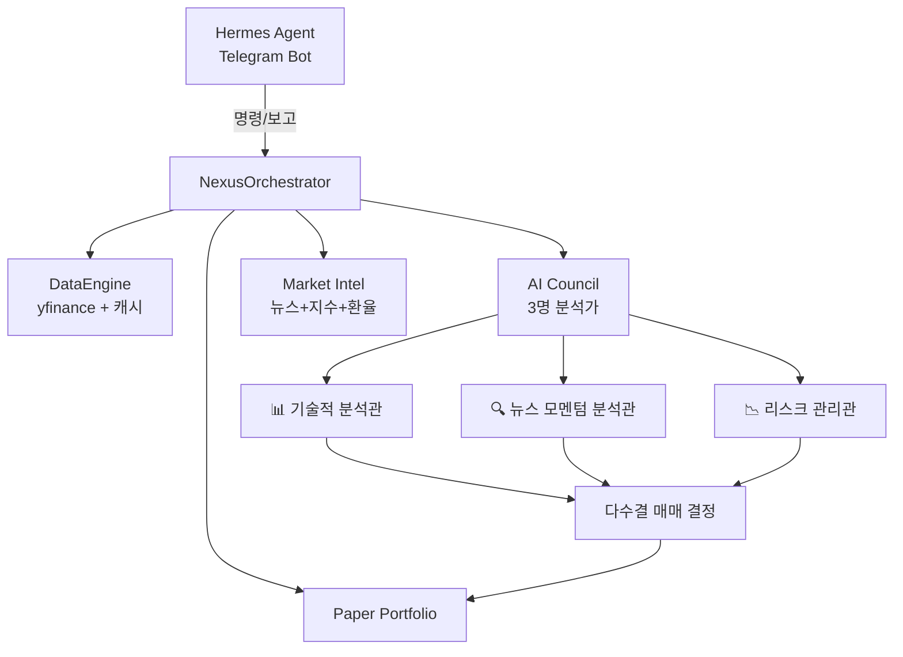

# 종다리(Jongdari) 모의투자 시스템

## 개요
AI 기반 한국 주식 모의투자 자동화 시스템. Hermes Agent가 총괄하며, AI Council(3명의 AI 분석가)이 독립적으로 분석하고 다수결로 매매 결정을 내린다.

| 항목 | 내용 |
|:-----|:------|
| **초기자본** | 5,000,000원 |
| **시작일** | 2026-04-27 |
| **운영모드** | 모의투자 (Paper Trading) |
| **코어엔진** | `nexus_orchestrator.py` v1.1 |
| **실행환경** | WSL2 Ubuntu, Python 3.11 |

## 시스템 아키텍처


## 주요 컴포넌트

### NexusOrchestrator (두뇌)
- **파일**: `nexus_orchestrator.py`
- **진입점**: `NexusOrchestrator` 클래스
- **통합 메서드**:
  - `run_battle_loop()` — 실시간 장중 매매 루프
  - `run_daily_analysis()` — 일간 분석
  - `backtest_strategy()` — 전략 백테스트
  - `analyze_sectors()` — 섹터 분석
  - `analyze_single_stock()` — 개별 종목 분석
  - `scan_and_analyze()` — 시장 스캔 + 분석

### DataEngine (데이터 수집)
- yfinance 기반 주가 데이터 수집
- 자체 SQLite 캐시로 중복 요청 방지
- 코스피(KOSPI), 코스닥(KOSDAQ) 지원
- 환율(USD/KRW), 원자재(WTI) 데이터

### AI Council (의사결정)
- 3명의 AI 분석가가 독립적으로 분석
- 각자 다른 관점에서 종목 평가
- 다수결로 최종 매매 결정

## 실행 방식
```bash
# 배틀루프 실행 (실시간)
python3 nexus_orchestrator.py --mode live

# 일간 분석
python3 nexus_orchestrator.py --mode daily
```

## 관련 링크
- [[02-Knowledge/System-Architecture|시스템 아키텍처 상세]]
- [[02-Knowledge/AI-Council|AI Council 분석 방법론]]
- [[02-Knowledge/Trading-Strategies|트레이딩 전략]]
- [[02-Knowledge/Operations-Guide|운영 가이드]]
