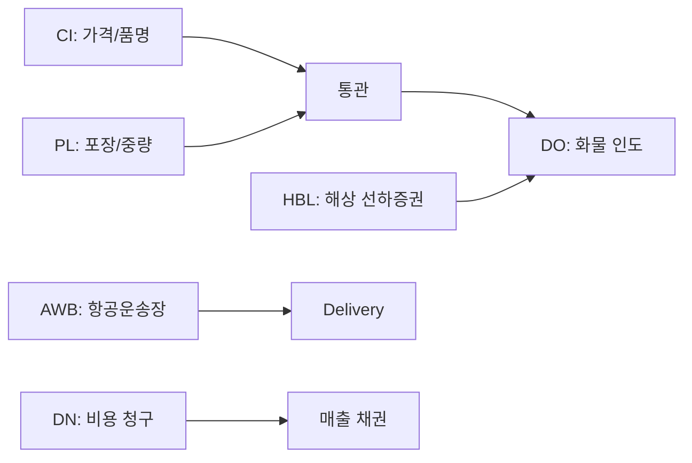

# 📄 서류 작성 가이드 (Documentation Guide)

> 포워딩 실무 필수 문서 작성 기준 — **미래국제물류** 기준

---

## HBL (House Bill of Lading)

### 개요
Forwarder(House)가 Shipper에게 발행하는 **선하증권**. MBL(Master B/L)보다 상세한 정보 포함.

### 기재 항목
| 필드 | 설명 |
|:-----|:------|
| **Shipper** | 화주 (수출자) — 정확한 법인명/주소 |
| **Consignee** | 수하인 — To Order or 특정 명의 |
| **Notify Party** | 통지처 — 실제 물품 인수자 |
| **Vessel / Voyage** | 선명 / 항차 |
| **POD (Port of Discharge)** | 양륙항 |
| **PLD (Place of Delivery)** | 최종 목적지 (필요시) |
| **Marks & Nos.** | 화물 식별 마크 |
| **Description** | 품명 — HS Code 반드시 포함 |
| **Gross Weight** | 총 중량 (kg) |
| **Measurement** | CBM (Cubic Meter) |
| **Container No.** | 컨테이너 번호 + Seal No. |

### 발행 시 주의
- **On Board Date** = 선적일 (정확히 기재)
- **Place of Issue** 보통 Seoul or Busan
- **Telex Release** 기재 시 원본 없이 DO 교환 가능
- **AMS/ISF** — 미국향 화물은 24시간 전 S/C 제출

---

## AWB (Air Waybill)

### 개요
항공화물의 **운송 계약 + 영수증 + 화물 정보** 역할. 항공사에 발행하거나 포워더가 HAWB 발행.

### 기재 항목
| 필드 | 설명 |
|:-----|:------|
| **Airport of Departure** | IATA 3자 코드 (ICN, NRT, LAX 등) |
| **Airport of Destination** | 도착지 IATA 코드 |
| **Carrier** | 항공사 IATA 코드 (KE, OZ, CX 등) |
| **Shipper/Consignee** | 발송인/수취인 |
| **Handling Information** | 특수 취급 주의사항 |
| **No. of Pieces** | 총 포장 수량 |
| **Gross Weight** | 총 중량 (kg) |
| **Rate Class** | Q(대량할인), C(계약운임), M(최소운임) 등 |
| **Chargeable Weight** | 실제중량 vs DIM Weight 중 큰값 |
| **Nature of Goods** | 품명 (HS Code 포함) |

### 발행 시 주의
- **HAWB (House AWB)** — 포워더가 Shipper에게 발행
- **MAWB (Master AWB)** — 항공사가 포워더에게 발행
- **Prepaid / Collect** — 선불/착불 구분
- **Dangerous Goods** — IATA DGR 규정 준수, Shipper's Declaration 필수

---

## DN (Debit Note)

### 개요
고객(Shipper/Consignee)에게 **비용 청구용** 문서. 실제 비용 발생 후 발행.

### 기재 항목
- **DN Number** — 일련번호 (YYYYMMDD-001)
- **Invoice To** — 청구 대상
- **Vessel / Flight** — 운송 정보
- **B/L or AWB No.** — 기준 운송 건
- **비용 항목** — Ocean Freight / THC / CFS / DOC / AMS / CUSTOMS / TRUCKING / INSURANCE 등
- **VAT** — 부가세 (한국 10%)
- **Total Amount** — 합계 (USD or KRW)

### 발행 시점
- Export: 선적 완료 후
- Import: 통관 완료 후
- 정기 정산: 월 1회 또는 건별

---

## DO (Delivery Order)

### 개요
화물 인도 지시서. 수입자가 **B/L 원본 or Telex Release**로 수령하여 보세구역(CY/CFS)에서 화물 인수.

### 발행 절차
1. **B/L 원본 반납** or **Telex Release 확인**
2. **DO 발행** — Carrier or Forwarder
3. **Trucker 제시** — CY/CFS 반출 시

### 유의사항
- **Original B/L required** — 원본 필수 국가 (중동, 남미 일부)
- **Express Release** — 원본 불필요, DO만으로 반출 가능
- **Sea Waybill** — 전자식, 원본 불필요
- **유효 기간** — 발행일 기준 7~14일 (초과 시 보관료 발생)

---

## CI (Commercial Invoice)

### 개요
수출자가 수입자에게 발행하는 **상업 송장**. 통관의 기준이 되는 가격 증빙 문서.

### 기재 항목
- **Invoice No.** — 송장 번호
- **Date** — 발행일
- **Shipper / Consignee** — 발송인/수취인
- **Terms of Delivery** — Incoterms (FOB, CIF, EXW, DDP 등)
- **Terms of Payment** — T/T, L/C, D/P 등
- **Description** — 품명, HS Code
- **Quantity** — 수량
- **Unit Price** — 단가
- **Total Amount** — 총 금액 (통화 명시)
- **Country of Origin** — 원산지

### 주의사항
- **가격 허위 기재** — 통관 지연/과태료 위험
- **FOB/CIF 구분** — 보험/운임 포함 여부 명확히
- **Sample/No Commercial Value** — 간이 통관용 기재

---

## PL (Packing List)

### 개요
화물의 **포장 단위별 내용물 명세서**. CI와 함께 통관 시 필수 제출.

### 기재 항목
- **Marks & Nos.** — 화물 마크
- **Package Type** — Pallet, Carton, Case, Crate 등
- **No. of Packages** — 포장 수
- **Net Weight** — 순중량 (kg)
- **Gross Weight** — 총중량 (kg)
- **Measurement** — CBM (가로×세로×높이)
- **Description** — 각 Package별 품명

### 주의사항
- **PL ≠ CI** — 가격 정보 불포함 (세관 검사용)
- **Package Type 표준화** — Pallet/Pkg/Ctn 등 통일
- **과부족 주의** — 검수 시 수량 불일치 클레임 원인

---

## 문서 간 관계

## 참고
- [[01-물류/포워딩-프로세스|포워딩 업무 흐름도]]
- [[01-물류/해상운송|해상운송]]
- [[01-물류/항공운송|항공운송]]
- [[01-물류/클레임/_index|클레임 관리]] — Document 유형 클레임
