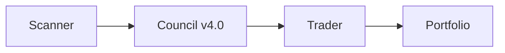

---
tags:
  - github
  - devtools
  - productivity
  - ideas
created: 2026-04-29
---

# 💡 기발한 GitHub 아이디어 — 우리에 적용

> 생산성, 코드 품질, 시스템 안정성에 직결되는 오픈소스 발굴

---

## 🏆 TOP 5 — 바로 적용 가능

### 1️⃣ Ruff (47k⭐) — 초고속 Python 린터
**링크:** https://github.com/astral-sh/ruff
**핵심:** Rust로 만든 Python 린터+포맷터. Black+isort+flake8을 하나로 대체
**✅ 이미 설치됨!** `pyproject.toml`에 있지만 `exclude = ["*"]`로 **비활성화 상태**
**→ .** `exclude` 해제하고 활성화만 하면 즉시 코드 품질 향상!

### 2️⃣ uv (84k⭐) — 초고속 Python 패키지 매니저
**링크:** https://github.com/astral-sh/uv
**핵심:** pip보다 10-100배 빠른 패키지 설치/관리
**✅ 이미 사용 중!** `uv.lock` 존재, 캐시 활성화
**→ .** 최적 도입 완료 — 유지

### 3️⃣ The Fuck (90k⭐) — 잘못된 명령어 자동수정
**링크:** https://github.com/nvbn/thefuck
**핵심:** `fuck` 치면 직전 명령어 오류를 자동으로 수정해줌
- 예: `git brnch` → `fuck` → `git branch`
- **→ Hermes 자가치유 시스템에 접목!** 명령 실패시 자동 대체 명령 제안

### 4️⃣ fzf (68k⭐) — 터미널 퍼지 파인더
**링크:** https://github.com/junegunn/fzf
**핵심:** 모든 리스트를 인터랙티브 검색. 파일/히스토리/프로세스 등
- `Ctrl+R` → 명령어 히스토리 퍼지 검색
- `**` + `Tab` → 파일 경로 퍼지 검색
- **→ Jenkins/배치 작업 선택 UI로 활용!**

### 5️⃣ pre-commit (15k⭐) — Git 훅 기반 코드 검사
**링크:** https://github.com/pre-commit/pre-commit
**핵심:** 커밋 전에 린터/포맷터/타입 체커 자동 실행
**→ 우리 시스템에 도입하면:**
  - 커밋 전에 자동으로 Ruff 검사
  - 타입 오류, 포맷 오류 사전 차단
  - CI에서 터지는 거 방지

---

## ⚡ 워크플로우/자동화

### 6️⃣ Temporal (20k⭐) — Durable 워크플로우 엔진
**링크:** https://github.com/temporalio/temporal
**핵심:** 장기 실행 워크플로우, 서버 죽어도 자동 복구
- **→ 배틀루프의 워크플로우 엔진으로!** 지금의 단순 while 루프 대신 Temporal 도입
- 사이클 중간에 서버 꺼져도 복구됨

### 7️⃣ Celery (28k⭐) — 분산 태스크 큐
**링크:** https://github.com/celery/celery
**핵심:** 비동기 작업 큐, 스케줄링
- **→ 배틀루프의 스캔/분석/매매 작업을 비동기 분산 처리**
- 10분 대기 대신 이벤트 기반 처리

### 8️⃣ Prefect (22k⭐) — Python 네이티브 파이프라인
**링크:** https://github.com/PrefectHQ/prefect
**핵심:** 데코레이터 하나로 복원력 있는 파이프라인
- `@flow`, `@task` 데코레이터만 붙이면 자동 재시도/로깅/모니터링
- **→ nexus_orchestrator를 Prefect로 리팩토링하면 10배 안정적!**

---

## 🧠 멀티에이전트 특화

### 9️⃣ MS Agent Framework (10k⭐) — AutoGen 후속
**링크:** https://github.com/microsoft/agent-framework
**핵심:** 엔터프라이즈 멀티에이전트. A2A+MCP 지원
- **→ AI Council v4.0과 비교 분석 필요!** MS 공식이니 안정성 높음

### 🔟 ElizaOS (20k⭐) — 멀티에이전트 플랫폼
**링크:** https://github.com/elizaos/eliza
**핵심:** Discord/Telegram/Farcaster 등 다양한 채널 에이전트
- **→ Hermes와 구조 유사!** 플러그인 시스템 아키텍처 참고

---

## 📊 트레이딩/데이터

### 11️⃣ Public APIs (428k⭐) — 모든 공개 API
**링크:** https://github.com/public-apis/public-apis
**핵심:** 50개 카테고리 수백개 무료 API
- 금융: Alpha Vantage, IEX Cloud, Twelve Data 등
- **→ Jongdari 데이터 소스 다양화**

### 12️⃣ Mermaid (87k⭐) — 텍스트 다이어그램
**링크:** https://github.com/mermaid-js/mermaid
**핵심:** 코드로 다이어그램 생성

- **→ 우리 Wiki/문서에 시스템 아키텍처 다이어그램 자동 생성!**

---

## 🎯 실행 우선순위

| 순위 | 프로젝트 | 행동 | 난이도 | 효과 |
|:----:|:---------|:-----|:------:|:----:|
| ⭐⭐⭐ | **Ruff 활성화** | `exclude = ["*"]` 제거 | 초간단 | 즉시 코드 품질 향상 |
| ⭐⭐⭐ | **pre-commit** | `.pre-commit-config.yaml` 생성 | 쉬움 | 자동 코드 검사 |
| ⭐⭐ | **fzf 설치** | `apt install fzf` | 1분 | 터미널 생산성 2배 |
| ⭐⭐ | **thefuck 설치** | `pip install thefuck` | 1분 | 명령어 오류 즉시 복구 |
| ⭐⭐ | **Mermaid 도입** | Wiki 문서에 Mermaid 추가 | 쉬움 | 가시성 향상 |
| ⭐ | **Temporal/Prefect** | 아키텍처 검토 | 복잡 | 장기적으로 가장 큰 효과 |

---

> 마지막 업데이트: 2026-04-29 22:00
