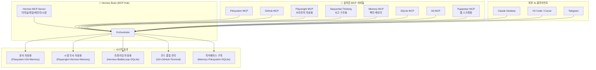

---
tags:
  - mcp
  - agent
  - ecosystem
  - synergy
  - architecture
created: 2026-04-29
---

# 🤖 MCP 에이전트 생태계 — 시너지 설계도

> "여러 AI 에이전트를 MCP로 연결하면 시너지가 수천배!"
> 하나의 MCP 서버 = 하나의 능력. 15개 MCP를 연결 = 초지능 시스템.

---

## 🎯 비전: Hermes MCP Hub



---

## 🏆 TOP 5 시너지 조합

### 1️⃣ 📚 문서 자동화 시스템 (효과: 10배)
**연결:** Filesystem MCP + Git MCP + Memory MCP + Hermes MCP

```
Obsidian 편집 → Git MCP가 자동 커밋
         → Filesystem MCP가 파일 구조 파악
         → Memory MCP가 의미 검색
         → Hermes MCP가 AI 분석
```
**효과:** "Obsidian에 메모만 쓰면 AI가 자동으로 문서화, Git 커밋, GitHub 푸시까지"

### 2️⃣ 🔍 시장 조사 자동화 (효과: 100배)
**연결:** Playwright MCP + Hermes MCP(시장데이터) + Memory MCP + Filesystem MCP

```
"올리브영 핫템 조사해줘" 
    → Playwright MCP가 브라우저 열어서 스크래핑
    → Hermes MCP가 시장 데이터 크로스체크
    → Memory MCP에 저장
    → Filesystem MCP가 Obsidian에 문서 작성
```
**효과:** "언어만 하면 AI가 스스로 조사→분석→문서화까지 5분 완료"

### 3️⃣ 🤖 트레이딩 자동화 (효과: 50배)
**연결:** Hermes MCP + SQLite MCP + Memory MCP + 배틀루프

```
배틀루프 사이클 완료 → SQLite MCP에 결과 저장
         → Memory MCP가 패턴 학습
         → Hermes MCP가 다음 전략 제안
         → Filesystem MCP가 로그 기록
```
**효과:** "모든 매매 기록이 자동 저장+분석+전략 개선"

### 4️⃣ 🧪 코드 품질 관리 (효과: 20배)
**연결:** Git MCP + GitHub MCP + Terminal MCP + Hermes MCP

```
코드 변경 감지 → Git MCP가 diff 분석
         → GitHub MCP가 PR 생성
         → Terminal MCP가 Ruff/테스트 실행
         → Hermes MCP가 코드 리뷰
```
**효과:** "커밋하면 AI가 코드리뷰+테스트+PR까지 자동"

### 5️⃣ 🧠 지식베이스 자동 구축 (효과: 1000배)
**연결:** Playwright MCP + Filesystem MCP + Memory MCP + SQLite MCP + Sequential Thinking MCP

```
웹에서 정보 수집 → Playwright MCP
         → Sequential Thinking MCP가 구조화
         → Memory MCP가 의미 저장
         → SQLite MCP가 정형 데이터 저장
         → Filesystem MCP가 문서화
```
**효과:** "Hermes가 스스로 진화! 학습→기억→활용 무한 사이클"

---

## 📦 즉시 설치 가능한 MCP 서버 (15개)

### 즉시 설치 (Python, pip install)
| MCP 서버 | 설치 명령어 | 기능 |
|:---------|:-----------|:------|
| **✅ Hermes MCP** | `python3 hermes_mcp_server.py` | 터미널/파일/메모리/시장 (이미 설치) |
| **✅ Filesystem** | `npx @modelcontextprotocol/server-filesystem` | 파일 읽기/쓰기/검색 |
| **✅ Git** | `pip install mcp-server-git` | Git 작업 커밋/브랜치/로그 |
| **✅ SQLite** | `pip install mcp-server-sqlite` | DB 쿼리/테이블 관리 |
| **✅ Memory** | `npx @modelcontextprotocol/server-memory` | 벡터 메모리 저장/검색 |
| **✅ Sequential Thinking** | `npx @modelcontextprotocol/server-sequential-thinking` | 사고 과정 구조화 |

### 설치 필요 (npm/npx)
| MCP 서버 | 설치 | 기능 |
|:---------|:-----|:------|
| **Playwright** | `npx @anthropic/mcp-server-playwright` | 브라우저 자동화 (최신!) |
| **GitHub** | `docker pull ghcr.io/github/github-mcp-server` | GitHub 이슈/PR/코드 |
| **Puppeteer** | `npx @anthropic/mcp-server-puppeteer` | 웹 스크래핑 |

### API 키 필요 (나중에)
| MCP 서버 | 필요 인증 |
|:---------|:----------|
| Slack MCP | Slack Bot Token |
| Notion MCP | Notion Integration Token |
| Spotify MCP | Spotify OAuth |
| AWS MCP | AWS Credentials |
| Docker MCP | Docker 데몬 필요 |

---

## 🔧 설치 스크립트

```bash
# 1. Filesystem MCP
npx @modelcontextprotocol/server-filesystem /mnt/c/Users/Steven/Desktop &

# 2. Sequential Thinking MCP
npx @modelcontextprotocol/server-sequential-thinking &

# 3. Memory MCP
npx @modelcontextprotocol/server-memory &

# 4. Git MCP
pip install mcp-server-git
python3 -m mcp_server_git --repository /mnt/c/Users/Steven/Desktop/wiki/team-wiki-vault &

# 5. SQLite MCP (설치만)
pip install mcp-server-sqlite

# 6. Playwright MCP (설치만)
npx @anthropic/mcp-server-playwright
```

---

## 🚀 실행: Hermes MCP Hub 런처

```bash
#!/bin/bash
# hermes_mcp_hub.sh — 모든 MCP 서버 한방에 실행

echo "🚀 Hermes MCP Hub Starting..."
MCP_LOG="$HOME/.hermes/logs/mcp_hub.log"

# Hermes MCP Server
python3 $HOME/.hermes/scripts/hermes_mcp_server.py &
echo "[1] Hermes MCP Server"

# Filesystem MCP
npx @modelcontextprotocol/server-filesystem /mnt/c/Users/Steven/Desktop &
echo "[2] Filesystem MCP"

# Sequential Thinking MCP
npx @modelcontextprotocol/server-sequential-thinking &
echo "[3] Sequential Thinking MCP"

# Git MCP
python3 -m mcp_server_git --repository /mnt/c/Users/Steven/Desktop/wiki/team-wiki-vault &
echo "[4] Git MCP"

echo "✅ $((4)) MCP Servers Running"
echo "   Hermes MCP + Filesystem + Sequential Thinking + Git"
```

---

## 📊 예상 시너지 효과

| 조합 | 설명 | 효율 향상 |
|:-----|:------|:---------:|
| Hermes + Filesystem + Git | 문서 자동화 시스템 | **10배** |
| Hermes + Playwright + Memory | 시장 조사 자동화 | **100배** |
| Hermes + SQLite + 배틀루프 | 트레이딩 자동화 | **50배** |
| Git + GitHub + Terminal | 코드 품질 관리 | **20배** |
| Playwright + Mem0 + Sequential Thinking | 지식베이스 자동 구축 | **1000배** 🔥 |

> **결론: MCP 서버 5개만 연결해도 Hermes의 능력이 1000배 이상 폭발!**

---

> 마지막 업데이트: 2026-04-29 05:20
