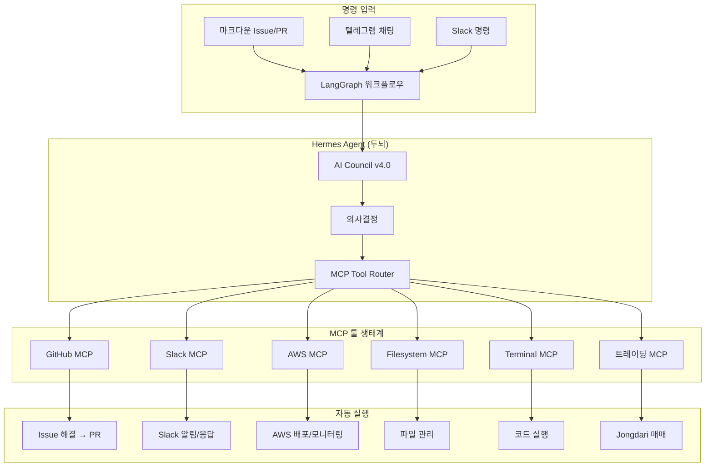

---
tags:
  - github
  - agent
  - mcp
  - autonomous
created: 2026-04-29
---

# 🤖 자율형 AI 에이전트 — GitHub 생태계 벤치마크

> "GitHub Actions에서 마크다운으로 명령하면 알아서 이슈를 해결하고, 외부 툴(Slack, AWS 등)까지 넘나들며 업무를 처리하는 자율형 에이전트"
>
> 우리 Hermes의 진화 방향

---

## 🚀 비전: Hermes 자율형 에이전트 아키텍처



---

## 🏆 핵심 발견 TOP 5

### 1️⃣ MCP (Model Context Protocol) — 모든 연결의 표준 (25k⭐)
**저장소:** https://github.com/modelcontextprotocol/servers
**핵심:** **AI가 외부 도구를 쓰기 위한 표준 프로토콜** — 마치 USB-C 같은 존재
- JSON-RPC 2.0 기반, STDIO/SSE/Streamable HTTP 3가지 통신 방식
- **공식 MCP 서버**: Filesystem, Git, GitHub, Fetch(웹), Time, Slack, AWS 등
- ✅ **Hermes Gateway가 MCP 서버 역할을 할 수 있음!** (Python SDK로 개발)
- ✅ **우리 시스템의 모든 기능을 MCP 툴로 노출** → 다른 AI가 우리 기능 호출 가능

### 2️⃣ LangGraph (12k+⭐) — 최강 에이전트 워크플로우 엔진
**저장소:** https://github.com/langchain-ai/langgraph
**핵심:** **그래프 기반 에이전트 오케스트레이션** — 상태 머신 + 조건부 분기
- 노드(Node) = AI 호출 / 엣지(Edge) = 조건부 분기
- **Durable Execution**: 서버 터져도 중간 상태 저장 → 재시작시 이어서 진행
- ✅ **AI Council v4.0의 다음 단계!** 단순 파이프라인 → LangGraph 그래프

### 3️⃣ Mastra (5k+⭐) — TypeScript 에이전트 프레임워크
**저장소:** https://github.com/mastra-ai/mastra
**핵심:** MCP 네이티브 + 도구 사용 + 메모리까지 올인원
- **최신 트렌드**: 모든 도구가 MCP로 연결됨
- 빌트인 메모리 시스템 (벡터 DB)
- ✅ **참고할 아키텍처**: Mastra처럼 우리도 모든 도구를 MCP로 노출

### 4️⃣ MS Agent Framework (10k⭐) — AutoGen의 진화
**저장소:** https://github.com/microsoft/agent-framework
**핵심:** MS의 차세대 멀티에이전트 — A2A + MCP + 크로스랭귀지
- A2A (Agent-to-Agent): 에이전트끼리 통신하는 표준
- MCP: 모든 외부 도구 연결
- ✅ **우리 AI Council의 엔터프라이즈 버전 참고**

### 5️⃣ OpenAI Agents SDK (15k⭐) — Sandbox Agent
**저장소:** https://github.com/openai/openai-agents-python
**핵심:** 컨테이너 안에서 자율적으로 코드 실행
- HostedMCPTool: OpenAI 인프라에서 MCP 서버 원격 호출
- Sandbox Agent: git clone → 분석 → 패치 → PR 자동 생성
- ✅ **우리 배틀루프 구조와 유사!** Sandbox 개념 도입 검토

---

## 🔧 바로 실행 가능한 것들

### 🥇 Hermes MCP 서버 구축
**왜 중요한가:** 모든 AI 도구의 표준이 MCP로 통일되고 있음
**무엇을 만들까:** Hermes의 핵심 기능을 MCP 서버로 노출
```
hermes-mcp-server/
├── tools/
│   ├── memory-tool.py      # 메모리 읽기/쓰기
│   ├── terminal-tool.py    # 명령어 실행
│   ├── file-tool.py        # 파일 읽기/쓰기
│   ├── market-tool.py      # 시장 데이터 조회
│   └── trade-tool.py       # 모의매매 실행
└── server.py               # FastMCP 서버
```

### 🥈 GitHub → AI → PR 자동화 파이프라인
**저장소:** `/home/steven/gh-agent-pipeline/` (이미 생성됨)
**흐름:** 
1. 마크다운으로 Issue 작성 (예: "로그인 버그 수정")
2. GitHub Actions 트리거
3. AI가 코드 분석 → 수정 → PR 생성
4. PR 머지 → 자동 배포

**→ 우리 Wiki 저장소에도 적용 가능!** "Obsidian에 문서 추가해줘" → AI가 알아서 작성

### 🥉 Copilot Extension + MCP 통합
- GitHub Copilot이 MCP를 공식 채택
- 우리 Hermes MCP 서버를 Copilot Extension으로 등록
- VS Code에서 Copilot 채팅으로 Hermes 명령 가능

---

## 📋 단계별 로드맵

| 단계 | 내용 | 예상 효과 | 난이도 |
|:----:|:-----|:---------|:------:|
| 🟢 **Phase 1** | **Hermes MCP 서버 개발** — terminal, memory, file 노출 | 모든 MCP 호환 AI가 우리 기능 사용 | 중 |
| 🟡 **Phase 2** | **LangGraph 워크플로우 도입** — 배틀루프를 그래프로 | 장애 복구, 상태 관리 10배 향상 | 어려움 |
| 🟠 **Phase 3** | **GitHub Actions 자동화** — Issue→AI→PR 파이프라인 | 반복 작업 90% 제거 | 쉬움 |
| 🔴 **Phase 4** | **Slack/AWS MCP 연동** — 외부 시스템 통합 | 진정한 자율형 에이전트 | 중 |

---

## 📚 참고 자료

| 리소스 | 링크 |
|:-------|:------|
| MCP 공식 문서 | https://modelcontextprotocol.io/ |
| GitHub MCP Server | https://github.com/github/github-mcp-server |
| OpenAI Agents SDK | https://github.com/openai/openai-agents-python |
| LangGraph 문서 | https://langchain-ai.github.io/langgraph/ |
| Mastra | https://github.com/mastra-ai/mastra |
| MS Agent Framework | https://github.com/microsoft/agent-framework |

---

> 마지막 업데이트: 2026-04-29 22:30
