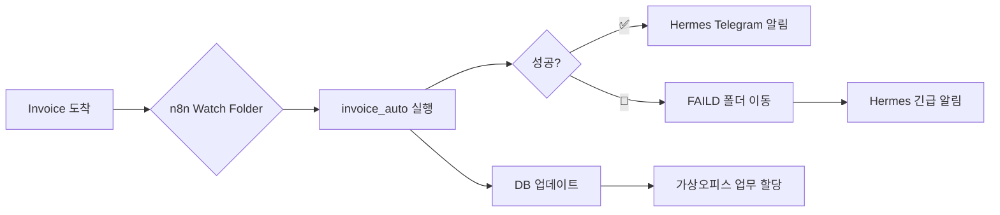

# 🔄 워크플로우 자동화 엔진 선택 가이드

> n8n / Dify / Activepieces / LangFlow 중 우리 시스템에 최적인 것은?

## 📊 비교표

| 항목 | 🥇 **n8n** | **Dify.ai** | Activepieces | LangFlow |
|:---|:---:|:---:|:---:|:---:|
| **종류** | 워크플로우 자동화 | LLM 앱 빌더 | 워크플로우 자동화 | 시각적 LangChain |
| **오픈소스** | ✅ (Fair-code) | ✅ (Apache 2.0) | ✅ (MIT) | ✅ (MIT) |
| **자체호스팅** | ✅ Docker | ✅ Docker | ✅ Docker | ✅ pip |
| **AI/LLM 내장** | ⭐⭐⭐ | ⭐⭐⭐⭐⭐ | ⭐⭐ | ⭐⭐⭐⭐⭐ |
| **API 통합** | 400+개 | 제한적 | 200+개 | LangChain 도구 |
| **시각적 편집** | ✅ 드래그드롭 | ✅ 플로우 | ✅ 드래그드롭 | ✅ 드래그드롭 |
| **커뮤니티** | ⭐⭐⭐⭐⭐ 50k⭐ | ⭐⭐⭐⭐ 60k⭐ | ⭐⭐⭐ 15k⭐ | ⭐⭐⭐ 25k⭐ |
| **리소스** | 가벼움 | 중간 | 매우 가벼움 | 중간 |
| **Hermes 연동** | ✅ webhook | ✅ API | ✅ webhook | ✅ API |

## 🏆 추천: **n8n**

### 이유
1. **이미 설치 경험 있음** — WSL Docker로 설치 완료했었음
2. **워크플로우 + AI 노드** — LangChain 내장으로 AI 파이프라인 구축 가능
3. **400+ 통합** — Telegram, Email, DB, API 전부 지원
4. **자체호스팅 무료** — Community Edition으로 충분
5. **webhook 트리거** — Hermes API Gateway(:8642)와 연동 최적

### 우리 시스템 적용 예시



### n8n 설치
```bash
docker run -d --restart always \
  --name n8n \
  -p 5678:5678 \
  -v ~/.n8n:/home/node/.n8n \
  n8nio/n8n
```

### 🔗 연동 시나리오 (우선순위순)

| 우선순위 | 워크플로우 | 설명 |
|:---:|:---|:---|
| 🥇 | Invoice 도착 → 자동 처리 → 알림 | 지금 cronjob이 하는 일을 n8n 시각화 |
| 🥇 | 견적 요청 → Hermes 호출 → 텔레그램 전송 | Freight Quote + 자동 회신 |
| 🥈 | 정기 데이터 수집 → Wiki 저장 | Tavily 검색 자동화 |
| 🥈 | 가상오피스 → 주기적 업무 리포트 | 직원들 KPI 자동 집계 |
| 🥉 | 멀티 LLM 라운드테이블 예약 실행 | cron보다 시각적인 스케줄링 |

## 🔗 관련 링크
- [[07_AI견적서_플랫폼|AI 견적서 플랫폼]]
- [[01_AI물류에이전트_SaaS|AI 물류 에이전트 SaaS]]
