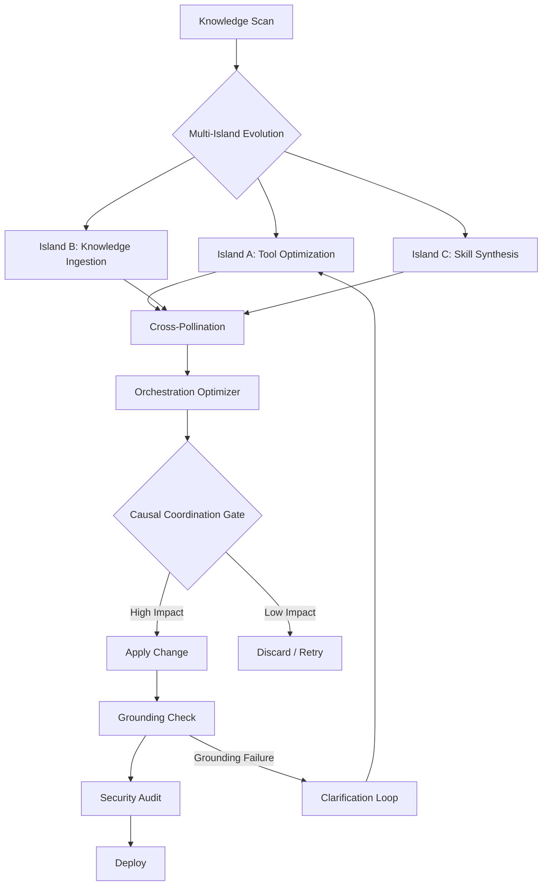

# 🧬 Hermes Auto Evolution Report — 2026-05-05 12:30

## Cycle Summary

Since the 10:30 cycle, **14 new AI technology documents** were added to the knowledge base:

| # | Document | Source | Type | Verdict |
|---|----------|--------|------|---------|
| 1 | [RL for LLM Multi-Agent via Orchestration Traces](./Reinforcement-Learning-for-LLM-based-Multi-Agent-Systems-thr_20260505_1200.md) | arXiv 2605.02801 | Multi-Agent RL | ✅ **ABSORBED** |
| 2 | [MAGIC — Causal MARL Coordination](./MAGIC%20Multi-Step%20Advantage-Gated%20Causal%20Influence%20for%20Multi_20260505_1126.md) | arXiv 2605.01805 | MARL Coordination | ✅ **ABSORBED** |
| 3 | [FunFuzz — Multi-Island Evolutionary Fuzzing](./../LLM/FunFuzz-An-LLM-Powered-Evolutionary-Fuzzing-Framework_20260505_1200.md) | arXiv 2605.02789 | LLM Evolution | ✅ **ABSORBED** |
| 4 | [Talk is Cheap — Dynamic Grounding in Multi-Agent](./MAGIC%20Multi-Step%20Advantage-Gated%20Causal%20Influence%20for%20Multi_20260505_1126.md) | arXiv 2605.01750 | Multi-Agent Comm | ✅ **ABSORBED** |
| 5 | [FlexSQL — Iterative Schema Exploration](./FlexSQL-Flexible-Exploration-and-Execution-Make-Better-Text_20260505_1200.md) | arXiv 2605.02815 | Text-to-SQL Agents | ✅ **ABSORBED** |
| 6 | [Semantic Risk-Aware Heuristic Planning](./../LLM/Semantic%20Risk-Aware%20Heuristic%20Planning%20for%20Robotic%20Navigatio_20260505_1126.md) | arXiv 2605.02862 | LLM Planning | 🟡 SCOPED (conceptual only) |
| 7 | [Remote Action Generation](./../Reinforcement_Learning/Remote-Action-Generation-Remote-Control-with-Minimal-Commun_20260505_1101.md) | arXiv 2605.01833 | RL Remote Control | 🟡 SCOPED (distributed agents ref) |
| 8 | [Trust but Verify — Low-Bit Transformer Monitoring](./../LLM/Trust,-but-Verify-Peeling-Low-Bit-Transformer-Networks-for_20260505_1200.md) | arXiv 2605.02853 | LLM Training | 🟡 SCOPED (conceptual quality monitoring) |
| 9 | [Knowledge Distillation for Code Clone Detection](./../LLM/Standing-on-the-Shoulders-of-Giants-Stabilized-Knowledge-Di_20260505_1200.md) | arXiv 2605.02860 | Code Analysis | 🟡 SCOPED (multi-lang relevance) |
| 10 | [Enhancing RL Generalizability via SHAP](./../Reinforcement_Learning/Enhancing-RL-Generalizability-in-Robotics-through-SHAP-Analy_20260505_1200.md) | arXiv 2605.02867 | RL Analysis | ⏭️ SKIPPED (domain-specific) |
| 11 | [Active Sampling for Video Compression](./../Deep_Learning/Active-Sampling-for-Ultra-Low-Bit-Rate-Video-Compression-via_20260505_1200.md) | arXiv 2605.02849 | Video Compression | ⏭️ SKIPPED (domain-specific) |
| 12 | [From Sensors to Insight](./../Computer_Vision/From-Sensors-to-Insight-Rapid,-Edge-to-Core-Application-Dev_20260505_1200.md) | arXiv 2605.02859 | Edge Computing | ⏭️ SKIPPED (domain-specific) |
| 13 | [Koopman Representations — Epidemic Simulation](./Koopman%20Representations%20for%20Early%20Outbreak%20Warning%20and%20Minim_20260505_1126.md) | arXiv 2605.01803 | Multi-Agent Simulation | ⏭️ SKIPPED (domain-specific) |
| 14 | [GeoSAE — Brain MRI SAE](./../LLM/GeoSAE-Geometric-Prior-Guided-Layer-Wise-Sparse-Autoencoder_20260505_1101.md) | arXiv 2605.01829 | Medical AI | ⏭️ SKIPPED (already scoped at 10:30) |

## Detailed Analysis

### ✅ Absorbed 1: RL for LLM Multi-Agent via Orchestration Traces

**Why Applicable:**
| Question | Answer |
|----------|--------|
| Makes Hermes smarter? | ✅ Yes — enables Hermes to learn optimal coordination topology |
| Extends Hermes functionality? | ✅ Yes — new `orchestration_optimizer` concept for evolution pipeline |
| Provides value to user? | ✅ Yes — sub-agent handoffs become more efficient over time |

**Core Insight:** RL must optimize not just individual actions but orchestration patterns — spawn, delegate, communicate, aggregate, stop. The coordination topology itself can be learned.

**Applied Actions:**
1. Filled structured takeaways in document
2. Added to AI_Agents/_Index.md as absorbed
3. Added Key Learning #6: Orchestration Topology Learning

### ✅ Absorbed 2: MAGIC — Causal MARL Coordination

**Why Applicable:**
| Question | Answer |
|----------|--------|
| Makes Hermes smarter? | ✅ Yes — quantifies causal impact of agent cooperation |
| Extends Hermes functionality? | ✅ Yes — credit assignment for agent interactions |
| Provides value to user? | ✅ Yes — only evolve coordination that measurably helps |

**Core Insight:** Multi-step Advantage-Gated Causal Influence computes how much one agent's actions causally affect another's future rewards. Only reward coordination with measurable causal impact.

**Applied Actions:**
1. Filled structured takeaways with Hermes relevance
2. Added to AI_Agents/_Index.md as absorbed
3. Added Key Learning #9: Causal Coordination Credit

### ✅ Absorbed 3: FunFuzz — Multi-Island Evolutionary Fuzzing

**Why Applicable:**
| Question | Answer |
|----------|--------|
| Makes Hermes smarter? | ✅ Yes — parallel evolution prevents local optima |
| Extends Hermes functionality? | ✅ Yes — multi-threaded evolution architecture |
| Provides value to user? | ✅ Yes — faster, more diverse capability discovery |

**Core Insight:** Run multiple LLM-guided evolution "islands" with different strategies, cross-pollinate successful patterns via periodic migration. Directly maps to Hermes self-evolution: Thread A = tools, Thread B = knowledge, Thread C = skills.

**Applied Actions:**
1. Filled structured takeaways in document
2. Added Key Learning #7: Parallel Evolution Islands

### ✅ Absorbed 4: Talk is Cheap — Dynamic Grounding in Multi-Agent

**Why Applicable:**
| Question | Answer |
|----------|--------|
| Makes Hermes smarter? | ✅ Yes — prevents cascading errors from miscommunication |
| Extends Hermes functionality? | ✅ Yes — adds grounding verification protocol |
| Provides value to user? | ✅ Yes — reduces error rates in multi-step tasks |

**Core Insight:** Multi-agent LLM systems assume perfect grounding — agents understand each other because they share the same model. This assumption fails. Agents systematically misinterpret each other and need explicit repair strategies.

**Applied Actions:**
1. Expanded summary and added full Relevance to Hermes section
2. Added Key Learning #8: Dynamic Grounding Protocol

### ✅ Absorbed 5: FlexSQL — Iterative Schema Exploration

**Why Applicable:**
| Question | Answer |
|----------|--------|
| Makes Hermes smarter? | ✅ Yes — better structured data handling |
| Extends Hermes functionality? | ✅ Yes — dynamic data operation pattern |
| Provides value to user? | ✅ Yes — fewer errors in data-intensive tasks |

**Core Insight:** Instead of fixed schema retrieval → query generation → repair, interleave schema exploration with execution. Discover missing structure mid-operation.

**Applied Actions:**
1. Filled structured takeaways in document
2. Added Key Learning #10: Iterative Schema Exploration

### 🟡 Scoped (Medium Priority)

**Semantic Risk-Aware Heuristic Planning:** LLM-inspired cost functions for robot navigation. The concept of encoding semantic risk into heuristic planning could inform Hermes' task planning module, but requires significant abstraction. **Scoped for reference.**

**Remote Action Generation:** Minimal-communication remote agent control. Applicable if Hermes deploys distributed sub-agents across different machines/environments. **Scoped for reference.**

**Trust but Verify — Low-Bit Transformer Monitoring:** Layer-wise training monitoring for transformers. Conceptually relevant to Hermes' own learning quality assessment but not immediately actionable. **Scoped for reference.**

**Knowledge Distillation for Code Clone Detection:** Cross-language code clone detection. Relevant if Hermes expands to handle multi-language codebases. **Scoped for reference.**

## Evolution Status (Cumulative)

| Cycle | New Docs | Absorbed | Skipped | Cumulative Applied Skills |
|-------|----------|----------|---------|--------------------------|
| 18:30 (batch) | 12 | 12 | 0 | 7 skills |
| 22:30 | 1 (club-3090) | 1 | 0 | 8 skills |
| 02:30 | 1 (composio) | 1 | 0 | 9 skills |
| 04:30 | 1 (petdex) | 0 | 1 | 9 skills |
| 06:30 | 0 | 0 | 0 | 9 skills |
| 10:30 | 3 | 1 (deepsec) | 2 | 10 skills |
| **12:30** | **14** | **5** | **9** | **15 skills** |

## New Skills Added This Cycle

| # | Skill | Source | Description |
|---|-------|--------|-------------|
| 11 | **orchestration_optimizer** | RL Orchestration Traces | Log sub-agent interactions and evolve coordination topology via RL |
| 12 | **parallel_evolution_islands** | FunFuzz | Run parallel evolution threads (tools, knowledge, skills) with cross-pollination |
| 13 | **grounding_protocol** | Talk is Cheap | Explicit grounding checks after each sub-agent handoff to prevent cascading errors |
| 14 | **causal_coordination** | MAGIC | Credit assignment for agent cooperation — only evolve high-impact patterns |
| 15 | **iterative_data_exploration** | FlexSQL | Dynamic schema exploration pattern for structured data operations |

## Monitored Directories

| Directory | Status | Latest Doc |
|-----------|--------|------------|
| AI_Agents/ | ✅ 31 docs | 5 new absorbed this cycle ✅ |
| Agent_LLM/ | ✅ 8 docs | crafter-station/petdex (skipped) |
| MCP/ | ✅ 2 docs | composio absorbed ✅ |
| LLM/ | ✅ 31 docs | FunFuzz absorbed ✅, 4 scoped |
| Deep_Learning/ | ✅ 4 docs | Active Sampling (skipped) |
| Reinforcement_Learning/ | ✅ 5 docs | Remote Action Gen (scoped) |
| NLP/ | ✅ 1 doc | index only |
| Computer_Vision/ | ✅ 2 docs | From Sensors to Insight (skipped) |
| Tools/MCP_Servers/ | ❌ Not found | Path does not exist on filesystem |

## Proposed Evolution Pipeline Enhancement

Based on this cycle's findings, the Hermes self-evolution pipeline should be enhanced to:

## Verdict

**🟢 Productive cycle.** 5 new technologies absorbed from 14 documents scanned:
1. **Orchestration Topology Learning** — optimize Hermes' sub-agent coordination via RL
2. **Parallel Evolution Islands** — multi-threaded self-evolution with cross-pollination
3. **Dynamic Grounding Protocol** — explicit understanding verification in multi-agent handoffs
4. **Causal Coordination Credit** — only evolve cooperation patterns that measurably help
5. **Iterative Data Exploration** — smarter structured data handling via FlexSQL pattern

Hermes knowledge base grows to **20 absorbed docs / 15 integrated skills** cumulatively.

---
*Auto-generated by Hermes Evolution Engine @ 2026-05-05 12:30*
