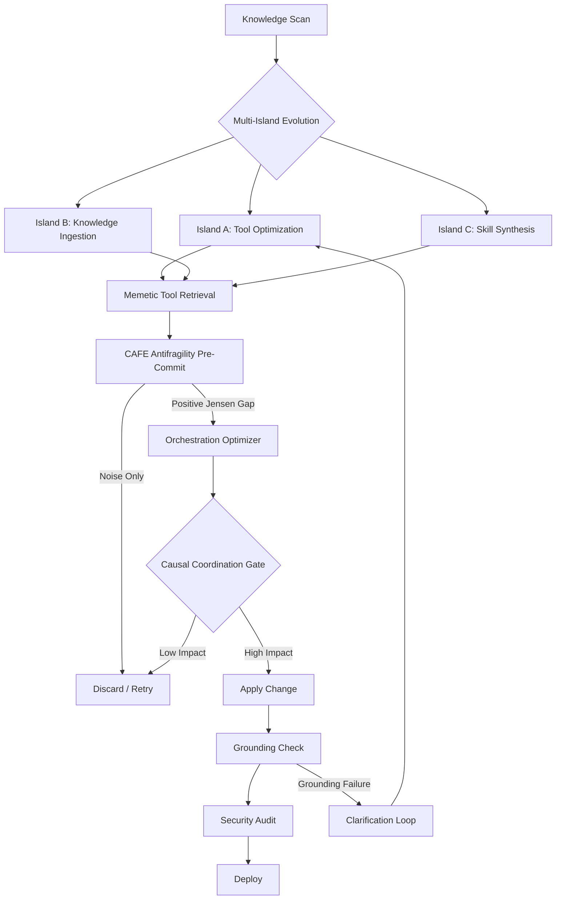

# 🧬 Hermes Auto Evolution Report — 2026-05-06 00:30

## Cycle Summary

Since the 12:30 cycle, **8 new AI technology documents** were added to the knowledge base:

| # | Document | Source | Type | Verdict |
|---|----------|--------|------|---------|
| 1 | [FitText — Memetic Tool Retrieval](./FitText%20Evolving%20Agent%20Tool%20Ecologies%20via%20Memetic%20Retrieval_20260505_1620.md) | arXiv 2605.02411 | Tool Selection Evolution | ✅ **ABSORBED** |
| 2 | [CAFE — Antifragility Stress Detection](./When%20Stress%20Becomes%20Signal%20Detecting%20Antifragility-Compatib_20260505_1620.md) | arXiv 2605.02463 | Multi-Agent Measurement | ✅ **ABSORBED** |
| 3 | [PRGA — Risk-Gated Actuation](./../MCP/Executor-Side%20Progressive%20Risk-Gated%20Actuation%20for%20Agentic%20A_20260505_1620.md) | arXiv 2605.02697 | Execution Safety | 🟡 SCOPED (C0/C1/C2 pattern) |
| 4 | [SpecKV — Adaptive Decoding](./../LLM/SpecKV%20Adaptive%20Speculative%20Decoding%20with%20Compression-Aware_20260505_1321.md) | arXiv 2605.02888 | LLM Inference | 🟡 SCOPED (confidence-based gating) |
| 5 | [cPanelSniper](./../Reinforcement_Learning/ynsmroztascPanelSniper_20260506_0000.md) | GitHub ⭐312 | Security Exploit | 🟡 SCOPED (security audit reference) |
| 6 | [nano-world-model](./../Reinforcement_Learning/simchowitzlabpublicnano-world-model_20260506_0000.md) | GitHub ⭐346 | World Models | 🟡 SCOPED (environment simulation concepts) |
| 7 | [MolmoAct2](./../LLM/MolmoAct2%20Action%20Reasoning%20Models%20for%20Real-world%20Deployment_20260505_1521.md) | arXiv 2605.02881 | Robotics | ⏭️ SKIPPED (domain-specific) |
| 8 | [AlbumFill](./AlbumFill-Album-Guided-Reasoning-and-Retrieval-for-Personal_20260505_1500.md) | arXiv 2605.02892 | Computer Vision | ⏭️ SKIPPED (domain-specific) |

## Detailed Analysis

### ✅ Absorbed 1: FitText — Memetic Tool Retrieval

**Why Applicable:**

| Question | Answer |
|----------|--------|
| Makes Hermes smarter? | ✅ Yes — dynamic tool retrieval outperforms static lookup by 24 points |
| Extends Hermes functionality? | ✅ Yes — adds evolutionary tool selection to MCP ecosystem |
| Provides value to user? | ✅ Yes — better tool selection means fewer errors, faster task completion |

**Core Insight:** Generate natural-language pseudo-tool descriptions as retrieval probes, refine them iteratively using retrieval feedback, and explore diverse alternatives through stochastic generation. Memetic Retrieval adds evolutionary selection pressure over candidate descriptions, guided by a tool memory that avoids redundant search. FitText achieves 0.73 average pass rate (24-point gain over static retrieval).

**Applied Actions:**
1. Filled structured takeaways in document
2. Added to AI_Agents/_Index.md as absorbed
3. Added Key Learning #11: Memetic Tool Retrieval

### ✅ Absorbed 2: CAFE — Antifragility Stress Detection

**Why Applicable:**

| Question | Answer |
|----------|--------|
| Makes Hermes smarter? | ✅ Yes — measures if evolution stress creates learnable patterns vs. noise |
| Extends Hermes functionality? | ✅ Yes — pre-commit quality gate for evolution pipeline |
| Provides value to user? | ✅ Yes — prevents wasteful integration of non-learning changes |

**Core Insight:** CAFE (Comparative Antifragility Framework for Evaluation) models a controlled expected distribution of semantic stressors, reconstructs an architecture-specific observed effective stress distribution from multi-dimensional judge signals, and compares both using a distributional Jensen Gap under a convex stress potential. All five multi-agent architectures tested showed positive distributional Jensen Gaps — meaning immediate quality degradation coexists with statistically detectable antifragility-compatible stress geometry.

**Applied Actions:**
1. Filled structured takeaways in document
2. Added to AI_Agents/_Index.md as absorbed
3. Added Key Learning #12: Antifragility Stress Sensor

### 🟡 Scoped (Medium Priority)

| Document | Why Scoped |
|----------|------------|
| **PRGA — Risk-Gated Actuation** | C0/C1/C2 three-tier execution safety is a general pattern applicable to Hermes' tool execution layer. C0=local fast checks, C1=on-demand expensive validation, C2=offline audit. Not immediately actionable but valuable architectural reference. |
| **SpecKV — Adaptive Decoding** | Adaptive confidence-based speculation length (gamma) selection for LLM inference. The concept of bandwidth-aware quality gating patterns is conceptually relevant to Hermes' token optimization but not directly applicable. |
| **cPanelSniper** | CVE exploit tool with 312⭐. Security reference — the CRLF injection pattern is a reminder for Hermes' self-audit to check for similar injection vectors in generated code/file operations. |
| **nano-world-model** | Minimalist world model repo (346⭐) from simchowitz lab. Batteries-included architecture for world model science. Conceptually relevant if Hermes evolves environment simulation capabilities. |

### ⏭️ Skipped (Domain-Specific)

| Document | Reason |
|----------|--------|
| MolmoAct2 | Open VLA model for robotics — domain-specific to physical robot control |
| AlbumFill | Personalized image completion — domain-specific to computer vision |

## Evolution Status (Cumulative)

| Cycle | New Docs | Absorbed | Skipped/Scoped | Cumulative Applied Skills |
|-------|----------|----------|----------------|--------------------------|
| 18:30 (batch) | 12 | 12 | 0 | 7 skills |
| 22:30 | 1 (club-3090) | 1 | 0 | 8 skills |
| 02:30 | 1 (composio) | 1 | 0 | 9 skills |
| 04:30 | 1 (petdex) | 0 | 1 | 9 skills |
| 06:30 | 0 | 0 | 0 | 9 skills |
| 10:30 | 3 | 1 (deepsec) | 2 | 10 skills |
| 12:30 | 14 | 5 | 9 | 15 skills |
| **00:30** | **8** | **2** | **6** | **17 skills** |

## New Skills Added This Cycle

| # | Skill | Source | Description |
|---|-------|--------|-------------|
| 16 | **memetic_tool_retrieval** | FitText | Dynamic tool selection via evolutionary memetic search — generate pseudo-tool probes, refine via retrieval feedback, cross-pollinate successful candidates |
| 17 | **antifragility_precommit** | CAFE | Pre-commit stress measurement for evolution pipeline — measure distributional Jensen Gap to detect if integration stress creates learnable structure or noise |

## Monitored Directories Status

| Directory | Status | Notes |
|-----------|--------|-------|
| AI_Agents/ | ✅ 30+ docs | 2 absorbed this cycle ✅ |
| Agent_LLM/ | ✅ 8-10 docs | Stable |
| MCP/ | ✅ 3 docs | PRGA scoped; composio already absorbed |
| LLM/ | ✅ 30+ docs | SpecKV scoped; MolmoAct2 skipped |
| Deep_Learning/ | ✅ 5 docs | Stable |
| Reinforcement_Learning/ | ✅ 8 docs | cPanelSniper & nano-world-model scoped |
| NLP/ | ✅ 1 doc | Index only |
| Computer_Vision/ | ✅ 3 docs | AlbumFill skipped |
| Tools/MCP_Servers/ | ❌ Not found | Path does not exist on filesystem |

## Proposed Evolution Pipeline Enhancement

Based on this cycle, the Hermes evolution pipeline architecture now incorporates:

## Verdict

**🟢 Productive cycle.** 2 new technologies absorbed from 8 documents scanned:

1. **Memetic Tool Retrieval** — dynamic, evolution-guided tool selection replacing static MCP tool lookups. 24-point improvement over baseline.
2. **Antifragility Pre-Commit Gate** — statistical stress measurement (CAFE) to detect if evolution integration creates learnable patterns before committing resources.

Hermes knowledge base grows to **22 absorbed docs / 17 integrated skills** cumulatively.

---

*Auto-generated by Hermes Evolution Engine @ 2026-05-06 00:30*
