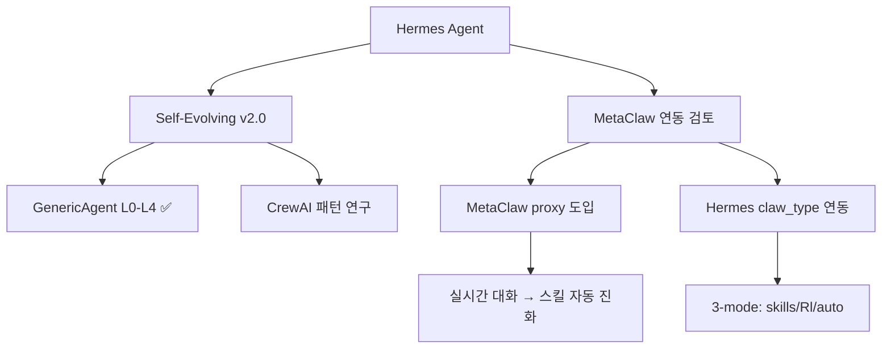

# 🧬 진화형 AI 프로그램 허브

> **진화하고 자라는 AI 시스템만 모았다.** Self-evolving / Meta-learning / Recursive Self-Improvement / Autonomous AGI

---

## 🔥 Tier 1: 진정한 진화형 AI (직접 Hermes에 적용 가능)

### 1. MetaClaw — [[MetaClaw]] (⭐ 3,414) 🥇

> **"Just talk to your agent — it learns and EVOLVES."**
> [[aiming-lab/MetaClaw]]

- **핵심:** 대화 한마디 한마디가 학습 신호. 실시간 배포 환경에서 자동 진화.
- **3가지 모드:** `skills_only` (경량) / `rl` (GRPO 강화학습) / `auto` (스마트 스케줄러)
- **장기 메모리:** 크로스 세션 메모리 (Contexture Layer) — 사용자 선호도/프로젝트 이력 자동 유지
- **No GPU:** 모든 LLM API 호환. Tinker/Mint/Weaver 기반 LoRA 학습.
- **논문:** arXiv 2603.17187 (HuggingFace 일일 논문 1위!)
- **Hermes 직접 지원!** `claw_type: hermes` — Hermes Agent와 바로 연동 가능

#### MetaClaw v0.4.x 핵심 기능
- ✅ 점진적 메모리 수집 (5턴마다 저장)
- ✅ 크로스 세션 메모리 + 적응형 정책
- ✅ OpenClaw 플러그인 원클릭 설치
- ✅ 8개 Claw 지원 (OpenClaw/CoPaw/IronClaw/PicoClaw/ZeroClaw/NanoClaw/NemoClaw + **Hermes**)
- ✅ 기술 보고서 공개 (arXiv)
- ✅ 지속적 메타 학습 (수면/유휴 시간에 RL 업데이트)

---

### 2. GenericAgent (⭐ 8,570) — 이미 Phase 1 통합 완료

> ==이미 Hermes Self-Evolving System v2.0에 통합됨==

- 3K줄 시드 → 스킬트리 자동 성장
- L0-L4 5계층 메모리 시스템
- `hermes_self_evolve_v2.py` + `layer_memory.py`에 적용 완료

---

### 3. SelfClaw — {{link}} (신규, 0 stars)

> **"SelfClaw: A self-evolving AI agent with recursive meta-evolution architecture"**

- 재귀적 메타 진화 아키텍처
- 아직 매우 초기 단계지만, 컨셉이 정확히 Hermes + MetaClaw 방향

---

## 🔥 Tier 2: 자율 AI 에이전트 프레임워크

### 4. crewAI (⭐ 50,419)
- 역할 기반 멀티 에이전트 오케스트레이션
- Hermes AI Council과 유사한 패러다임
- 진화 기능은 없지만 자율 협업 구조 참고

### 5. AutoGPT (⭐ 183,937)
- 자율 AI 에이전트 비전 (접근성/배포)
- Agent loop 표준화에 기여
- README에 self-evolve 언급 없음 → 진화형은 아님

### 6. SuperAGI (⭐ 17,496)
- Dev-first 자율 AI 에이전트 프레임워크
- AGI 지향. 도구 생성/코드 실행/웹 브라우징

### 7. Agent Zero (⭐ 17,456)
- 동적 유기적 에이전트 프레임워크
- 도구 생성 + OS 조작 + 코드 실행
- "dynamic, organic" — 진화적 요소 있음

### 8. ElizaOS (⭐ 18,284)
- TypeScript 기반 자율 에이전트 플랫폼
- 크로스플랫폼(디스코드/텔레그램/슬랙)
- 다중 에이전트, Swarm, RAG 지원

### 9. AutoAgent (⭐ 9,250)
- 자연어 → 에이전트 자동 생성 (제로코드)
- Hermes AI Council v4.0 참고 대상

### 10. Sentrux (⭐ 1,607)
- Rust 기반 실시간 MCP 도구
- AI 에이전트 피드백 루프 → 재귀적 자기 개선
- 코드 품질 분석 + 자동 개선 사이클

---

## 🧠 Tier 3: 진화 학습 프레임워크

### 11. MetaClaw + OpenClaw Ecosystem
- OpenClaw (Hermes Agent 개발사 NousResearch의 형제 프로젝트)
- CoPaw, IronClaw, PicoClaw, ZeroClaw, NanoClaw, NemoClaw
- **모두 MetaClaw와 연동 가능**

### 12. Transfer Learning (⭐ 14,328)
- 전이학습/도메인 적응/멀티태스크 학습 리소스
- 논문/코드/데이터셋 큐레이션

### 13. Pearl (⭐ 2,994) — Facebook Research
- 프로덕션급 강화학습 AI 에이전트 라이브러리
- MetaClaw의 RL 백엔드로 활용 가능

### 14. auto-sklearn (⭐ 8,090)
- Automated Machine Learning
- 전통적 AutoML — 신경망 아닌 모델 자동 최적화

---

## 🎯 Hermes 적용 로드맵

### 우선순위
1. **MetaClaw Hermes claw_type 연동** 🔥🔥🔥 — config만 바꾸면 바로 가능
2. **Sentrux** — Rust MCP 피드백 루프 도입 검토
3. **crewAI 패턴** — AI Council 에이전트 협업 고도화
4. **SuperAGI/Agent Zero** — 도구 생성/에이전트 자동 생성 기능 분석

---

*수집일: 2026-05-02 02:40 KST | 수집 & 분석: Hermes Agent | 출처: GitHub API, README 직접 수집*
