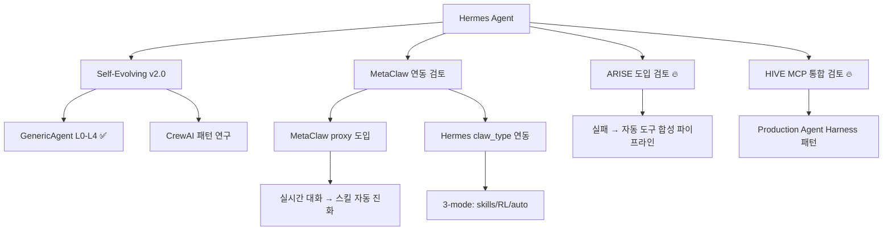

# 🧬 진화형 AI 프로그램 허브

> **진화하고 자라는 AI 시스템만 모았다.** Self-evolving / Meta-learning / Recursive Self-Improvement / Autonomous AGI

---

## 🔥 Tier 1: 진정한 진화형 AI (직접 Hermes에 적용 가능)

### 1. MetaClaw — [[MetaClaw]] (⭐ 3,414) 🥇

> **"Just talk to your agent — it learns and EVOLVES."**
> [[aiming-lab/MetaClaw]]

- **핵심:** 대화 한마디 한마디가 학습 신호. 실시간 배포 환경에서 자동 진화.
- **3가지 모드:** `skills_only` (경량) / `rl` (GRPO 강화학습) / `auto` (스마트 스케줄러)
- **장기 메모리:** 크로스 세션 메모리 (Contexture Layer) — 사용자 선호도/프로젝트 이력 자동 유지
- **No GPU:** 모든 LLM API 호환. Tinker/Mint/Weaver 기반 LoRA 학습.
- **논문:** arXiv 2603.17187 (HuggingFace 일일 논문 1위!)
- **Hermes 직접 지원!** `claw_type: hermes` — Hermes Agent와 바로 연동 가능

#### MetaClaw v0.4.x 핵심 기능
- ✅ 점진적 메모리 수집 (5턴마다 저장)
- ✅ 크로스 세션 메모리 + 적응형 정책
- ✅ OpenClaw 플러그인 원클릭 설치
- ✅ 8개 Claw 지원 (OpenClaw/CoPaw/IronClaw/PicoClaw/ZeroClaw/NanoClaw/NemoClaw + **Hermes**)
- ✅ 기술 보고서 공개 (arXiv)
- ✅ 지속적 메타 학습 (수면/유휴 시간에 RL 업데이트)

---

### 2. GenericAgent (⭐ 8,570) — 이미 Phase 1 통합 완료

> ==이미 Hermes Self-Evolving System v2.0에 통합됨==

- 3K줄 시드 → 스킬트리 자동 성장
- L0-L4 5계층 메모리 시스템
- `hermes_self_evolve_v2.py` + `layer_memory.py`에 적용 완료

#### genericagent-go (신규, 0⭐) — Go 포팅

| 메타 | 값 |
|:----|:---|
| **링크** | https://github.com/seastarbot/genericagent-go |
| **설명** | GenericAgent의 순수 Go 재작성. Zero dependencies, 단일 바이너리 |
| **핵심** | 동일한 3K 코어 + 스킬 결정화 시스템. goroutine 기반 동시성 안전 |
| **Hermes** | Go 포팅 참고 — Hermes의 차세대 코어 리팩토링 가능성 |
| **비고** | 초기 단계 (⭐0)이지만 아키텍처가 정확 |

---

### 3. SelfClaw — {{link}} (신규, 0 stars)

> **"SelfClaw: A self-evolving AI agent with recursive meta-evolution architecture"**

- 재귀적 메타 진화 아키텍처
- 아직 매우 초기 단계지만, 컨셉이 정확히 Hermes + MetaClaw 방향

---

### 4. ARISE (신규, ⭐6) 🔥

| 메타 | 값 |
|:----|:---|
| **링크** | https://github.com/abekek/arise |
| **설명** | **Adaptive Runtime Improvement through Self-Evolution** |
| **키워드** | self-evolving, adaptive, tool synthesis |
| **핵심** | 에이전트 실패 시 자동으로 **새 도구를 합성**하는 미들웨어 |
| **동작** | 작업 실패(3회) → Evolution Triggered → 새 도구 합성/테스트 → 재시도 성공 |
| **Hermes** | **🔥🔥🔥 최고 관심!** Hermes의 tool_call 실패 처리 + 자동 도구 생성 파이프라인과 정확히 같은 패러다임 |
| **차별점** | Framework-agnostic — 모든 LLM 에이전트에 붙일 수 있음. pypi 설치 가능 |

#### ARISE 상세 분석
```
Episode 1 | FAIL | reward=0.00 | skills=2  Task: "Fetch paginated users"
Episode 2 | FAIL | reward=0.00 | skills=2
Episode 3 | FAIL | reward=0.00 | skills=2  
[Evolution triggered — 3 failures]
  → Synthesizing 'parse_json_response'... 3/3 tests passed ✓
  → Agent retries with new tool → SUCCESS
```
- `pip install arise-ai` 로 즉시 사용 가능
- Hermes의 자동 스킬 생성 (hermes_self_evolve_v2 + MetaClaw)과 시너지 큼

---

### 5. Cellium-Agent (신규, ⭐36)

| 메타 | 값 |
|:----|:---|
| **링크** | https://github.com/Cellium-Project/Cellium-Agent |
| **설명** | **Self-Evolving AI Agent Framework** — Microkernel Architecture |
| **키워드** | self-evolving, microkernel, Bayesian Bandit, decision-loop |
| **핵심** | EventBus + DI + BaseTool 기반 마이크로커널. 베이지안 Bandit으로 적응형 결정 최적화 |
| **참고** | Strategy Gene 논문(arXiv 2604.15097) 기반 — 실패에서 학습하는 컴팩트 경험 표현 |
| **Hermes** | Hermes의 ToolRegistry + Decision Loop와 유사. 도입 검토 |
| **비고** | 중국어 기반 문서. FastAPI + React 풀스택 |

---

### 6. NEXUS Platform (신규, ⭐1)

| 메타 | 값 |
|:----|:---|
| **링크** | https://github.com/korfalor-cloud/nexus-platform |
| **설명** | 7개 오픈소스 AI 프로젝트를 하나로 연결하는 Self-Evolving 플랫폼 |
| **키워드** | self-evolving, self-improving, multi-agent, swarm-intelligence |
| **아키텍처** | WorldMonitor(인지) → MiroFish(예측) → Reason(추론) → Create(생성) → Evolve(진화) |
| **Hermes** | 개념적 참고 — 여러 AI 시스템을 통합하는 파이프라인 아키텍처 |
| **비고** | 이론적 아키텍처는 인상적이나 실용성은 낮음 |

---

### 7. babyagi-asi (신규, ⭐801) — AGI

| 메타 | 값 |
|:----|:---|
| **링크** | https://github.com/oliveirabruno01/babyagi-asi |
| **설명** | Artificial Super Intelligence — BabyAGI 기반 AGI 접근 |
| **핵심** | 작업 자동 생성/우선순위화/실행. 자율적 목표 추구 |
| **Hermes** | 작업 관리/목표 계층 구조 참고 가능 |
| **비고** | 개념 증명 수준. 실용적이진 않음 |

---

## 🔥 Tier 2: 자율 AI 에이전트 프레임워크

### 8. crewAI (⭐ 50,419)
- 역할 기반 멀티 에이전트 오케스트레이션
- Hermes AI Council과 유사한 패러다임
- 진화 기능은 없지만 자율 협업 구조 참고

### 9. AutoGPT (⭐ 183,937)
- 자율 AI 에이전트 비전 (접근성/배포)
- Agent loop 표준화에 기여
- README에 self-evolve 언급 없음 → 진화형은 아님

### 10. SuperAGI (⭐ 17,496)
- Dev-first 자율 AI 에이전트 프레임워크
- AGI 지향. 도구 생성/코드 실행/웹 브라우징

### 11. Agent Zero (⭐ 17,456)
- 동적 유기적 에이전트 프레임워크
- 도구 생성 + OS 조작 + 코드 실행
- "dynamic, organic" — 진화적 요소 있음

### 12. ElizaOS (⭐ 18,284)
- TypeScript 기반 자율 에이전트 플랫폼
- 크로스플랫폼(디스코드/텔레그램/슬랙)
- 다중 에이전트, Swarm, RAG 지원

### 13. AutoAgent (⭐ 9,250)
- 자연어 → 에이전트 자동 생성 (제로코드)
- Hermes AI Council v4.0 참고 대상

### 14. Sentrux (⭐ 1,927)
- Rust 기반 실시간 MCP 도구
- AI 에이전트 피드백 루프 → 재귀적 자기 개선
- 코드 품질 분석 + 자동 개선 사이클

### 15. HIVE (신규, ⭐10,213) 🔥

| 메타 | 값 |
|:----|:---|
| **링크** | https://github.com/aden-hive/hive |
| **설명** | **Multi-Agent Harness for Production AI** — Y Combinator 스타트업 |
| **키워드** | self-improving, multi-agent, production, MCP (102 tools!) |
| **핵심** | 프로덕션 워크로드를 위한 에이전트 하네스. 상태 관리/장애 복구/에이전트 간 통신 내장 |
| **특징** | 102개 MCP 도구 내장. Self-Improving 태그. Headless 개발 지원. Browser-Use 통합 |
| **Hermes** | **🔥🔥** MCP 생태계 + Production Agent Infrastructure 참고 |
| **비고** | YC 배치 출신. 실제 프로덕션 검증됨 |

### 16. Upsonic (신규, ⭐7,838)

| 메타 | 값 |
|:----|:---|
| **링크** | https://github.com/Upsonic/Upsonic |
| **설명** | **Build Autonomous AI Agents in Python** |
| **키워드** | autonomous-agent, agent-framework, MCP, computer-use |
| **핵심** | OpenClaw/Claude Cowork 스타일의 자율 에이전트 프레임워크. Cursor/Windsurf와 유사 |
| **특징** | IDE 통합(Cursor/VS Code). MCP 지원. 컴퓨터 사용(Computer Use) |
| **Hermes** | 참고 — Python 기반 자율 에이전트 프레임워크의 또 다른 접근법 |

### 17. SmythOS/SRE (신규, ⭐1,262)

| 메타 | 값 |
|:----|:---|
| **링크** | https://github.com/SmythOS/sre |
| **설명** | **"The Linux of AI Agents"** — 오픈소스 AI 에이전트 런타임 |
| **키워드** | agent-runtime, production, OS-kernel 아키텍처 |
| **핵심** | OS 커널에서 영감받은 에이전트 운영체제 계층. 프로덕션 배포에 필요한 인프라 전반 |
| **Hermes** | 참고 — Hermes의 배포/런타임 인프라 고도화 시 |

---

## 🧠 Tier 3: 진화 학습 프레임워크

### 18. MetaClaw + OpenClaw Ecosystem
- OpenClaw (Hermes Agent 개발사 NousResearch의 형제 프로젝트)
- CoPaw, IronClaw, PicoClaw, ZeroClaw, NanoClaw, NemoClaw
- **모두 MetaClaw와 연동 가능**

### 19. Transfer Learning (⭐ 14,327)
- 전이학습/도메인 적응/멀티태스크 학습 리소스
- 논문/코드/데이터셋 큐레이션

### 20. Pearl (⭐ 2,994) — Facebook Research
- 프로덕션급 강화학습 AI 에이전트 라이브러리
- MetaClaw의 RL 백엔드로 활용 가능

### 21. auto-sklearn (⭐ 8,089)
- Automated Machine Learning
- 전통적 AutoML — 신경망 아닌 모델 자동 최적화

---

## 🎯 Hermes 적용 로드맵 (v2.1 업데이트)



### 우선순위 (업데이트)
1. **MetaClaw Hermes claw_type 연동** 🔥🔥🔥 — config만 바꾸면 바로 가능
2. **ARISE (abekek/arise)** 🔥🔥 — 실패 기반 자동 도구 합성. Hermes의 hermes_self_evolve_v2와 시너지 최대
3. **HIVE (aden-hive/hive)** 🔥🔥 — Production MCP 인프라. 102개 MCP 도구 + 상태 관리 패턴
4. **Sentrux** — Rust MCP 피드백 루프 도입 검토
5. **Upsonic/Upsonic** — Python 자율 에이전트 프레임워크 참고
6. **crewAI 패턴** — AI Council 에이전트 협업 고도화
7. **SuperAGI/Agent Zero** — 도구 생성/에이전트 자동 생성 기능 분석

---

*수집일: 2026-05-04 05:00 KST | 수집 & 분석: Hermes Agent | 출처: GitHub API, README 직접 수집*
