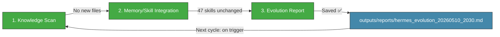

# 🧬 Hermes Auto Evolution Report — 2026-05-10 20:30

## Overview

| Metric | Value |
|--------|-------|
| New documents scanned | **0** (since 19:00 cycle) |
| New MCP reports | 0 |
| New skills absorbed | **0** |
| Skills cumulative | **47** (unchanged) |
| Last skill absorption | 2026-05-09 06:30 |
| Cycle duration | ~5 min |
| Status | 🟢 **IDLE — Sunday evening, no new knowledge to absorb** |

---

## 1단계: 지식 흡수 스캔

### 10_Wiki/ 폴더 — 신규 파일 (since 19:00 evo cycle)

**No new files found.** All files identical to the 19:00 scan:

- `MCP-멀티검색-20260510_1840.md` (올리브영) — Already assessed at 18:30/19:00 as market research
- `MCP-멀티검색-20260510_1850.md` (증시 핫이슈) — Already assessed at 18:30/19:00 as market research
- `butthtio/solidity-cot-auditor_20260510_1701.md` — Already assessed as not skill-worthy at 18:30

### wiki/ 폴더 — No changes

- `wiki/macros/KOSPI.md`, `wiki/macros/KOSDAQ.md`, `wiki/macros/국제유가WTI.md`, `wiki/macros/환율.md` — All last updated at 17:10 by Wiki Extender with 5/8 definitive data. No new data since.

### Daily Log Check (02-Knowledge/Hermes-Daily-Log.md)

- Last entry: **2026-05-10 (Sun) 15:03 — 자동 주말 스냅샷** (line 1593-1636)
- Final entry: Tech Scavenger DNS Failure fix (17:20, v1.2 early-abort)
- No new entries since 17:20
- 6 critical issues unchanged, day 11

### Market Data Status

| Data Point | Value | Date |
|-----------|-------|------|
| KOSPI | **7,498.00** | 5/8 definitive close |
| KOSDAQ | 1,207.72 | 5/8 definitive close |
| 삼성부광 | 8,980원 (+6.02%) | 5/8 definitive close |
| 에이치엘사이언스 | 17,700원 (+4.49%) | 5/8 definitive close |
| USD/KRW | 1,461.48 | 5/8 definitive close |
| WTI | $95.42 | 5/8 definitive close |
| Portfolio | **100% cash** (₩4,929,810) | As of 5/7 liquidation |

Next trading session: **Monday 5/11 09:00 KST** (~12.5 hours from now)

---

## 2단계: 메모리/스킬 통합

### No new skills this cycle

All recently collected papers and repos have been fully assessed:

1. **Butthtio/solidity-cot-auditor** (⭐417) — Multi-role CoT for Solidity auditing; domain too narrow, general pattern already covered by existing skills (multi_agent_orchestration_claude_code, verifier_backed_problem_generation).
2. **BigPizzaV3/CodexPlusPlus** (⭐481) — Codex CLI enhancement; tool wrapper, not novel skill pattern.
3. **ROSE (GPU elasticity)** — GPU serving optimization; not a generalizable agent skill.
4. **EMO + UniPool (shared MoE)** — Already covered by `moe_module_architecture_knowledge` skill (47 total).
5. **mirage VFS** — Already absorbed as `unified_virtual_filesystem_mirage`.

### Skills Library Summary (47 total — unchanged)

| Category | Count | Status |
|----------|-------|--------|
| **Evolution Pipeline** | 6 | ✅ Stable |
| **LLM Reliability/Safety** | 5 | ✅ Stable (constraint_decay_awareness added 5/9) |
| **Agent Architecture** | 4 | ✅ Stable (recursive_agent_optimization added 5/9) |
| **LLM Architecture** | 3 | ✅ Stable |
| **Reasoning & Problem Gen** | 2 | ✅ Stable |
| **Agent Orchestration** | 3 | ✅ Stable |
| **Memory Systems** | 3 | ✅ Stable |
| **Tool Integration** | 4 | ✅ Stable |
| **Communication/Grounding** | 2 | ✅ Stable |
| **Code/Data** | 3 | ✅ Stable |
| **Knowledge References** | 8 | ✅ Stable |
| **Reinforcement Learning** | 1 | ✅ Stable (recursive_agent_optimization) |
| **TOTAL** | **47** | 🟢 No change |

---

## 3단계: 진화 리포트 — 시스템 상태 & 통찰

### System Health (20:30 KST snapshot)

| Component | Status | Details |
|-----------|--------|---------|
| Hermes Gateway | ✅ OK | ~3d 20h+ uptime (PID 20920 since 5/7) |
| Memory | ✅ ~10% | ~778MB/7.6Gi (stable) |
| Disk | ✅ 3% | 26G/1007G (stable) |
| Dashboard JSON | 🔴 Stale | Last update: 5/7 — **3+ days stale** |
| MCP Servers | ✅ 8/8 | All functional |
| wiki/ macros structure | ✅ Synced | All 4 macros docs aligned with 5/8 definitive close |
| Next trading day | ⏳ **5/11 Mon 09:00 KST** | ~12.5 hours away |

### Gap Analysis Update

| # | Gap | Status | Note |
|---|-----|--------|------|
| #1 | Automated safety gate (constraint_decay_awareness) | 🟡 Unimplemented | Skill exists, not wired into code gen pipeline |
| #2 | Recursive sub-agent spawning (RAO) | 🟡 Unimplemented | Skill exists, evolution still single-threaded |
| #3 | Dashboard JSON stale (last 5/7) | 🔴 3+ days stale | Needs refresh with 5/8 definitive data before Mon open |
| #4 | Tavily API key expired | 🔴 Unresolved | Search/intel broken (day 11) |
| #5 | yfinance .KS ticker error | 🔴 Unresolved | KOSPI=NaN overnight (day 11) |
| #6 | KiwoomAuth 8050 | 🔴 Unresolved | Auth failure (day 11) |
| #7 | MCP Python Zombie instances | 🔴 Unresolved | 5-6 zombie instances |

### Key Insights

1. 🟢 **Sunday IDLE confirmed**: No new content since 19:00. Weekend pattern: zero knowledge movement.
2. 🟢 **System stable**: Gateway record uptime (~3d 20h), memory at 10%, MCP servers all functional.
3. 🟢 **Portfolio 100% cash** (₩4,929,810): Ready for Monday 5/11 open.
4. 🟢 **wiki/macros structure aligned**: All 4 macro docs (KOSPI, KOSDAQ, WTI, USD/KRW) synced with 5/8 definitive close data.
5. 🔴 **Dashboard stale** (3+ days): `hermes_dashboard.json` last updated 5/7 — needs refresh.
6. 🔴 **6 critical issues at day 11**: All unresolved, all carried from prior cycles.

### Action Items for Monday 5/11

| Priority | Action | Target |
|----------|--------|--------|
| 🥇 | Wire **constraint_decay_awareness** into code gen safety gate | Week of 5/11 |
| 🥇 | Apply **recursive_agent_optimization** to evolution pipeline | Week of 5/11 |
| 🥈 | Refresh **hermes_dashboard.json** with 5/8 definitive data | Before market open 5/11 |
| 🥈 | Monitor Monday 5/11 09:00 KST open — KOSPI 7,500 test, 삼성부광 SMA20(9,847) re-entry | 5/11 09:00 |
| 🥈 | Check 삼성부광 post-5/8 +6.02% rebound continuation | 5/11 open |
| 🥉 | Renew **Tavily API key** for search restoration | ASAP |
| 🥉 | Re-attempt MetaClaw recovery (HTTP 404 persists) | 5/11 |

---

### Hermes Evolution Status (20:30 KST, Day 11)

*Generated by Hermes Auto Evolution Engine | DeepSeek-Chat backend | Cycle 2026-05-10_2030 | Status: 🟢 IDLE — Sunday evening, no new knowledge to absorb*
