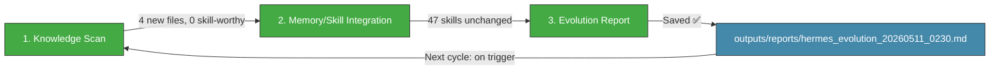

# 🧬 Hermes Auto Evolution Report — 2026-05-11 02:30

## Overview

| Metric | Value |
|--------|-------|
| New documents scanned | **4** (since 20:30 cycle) |
| New MCP reports | 1 (올리브영 인기상품) |
| New skills absorbed | **0** |
| Skills cumulative | **47** (unchanged) |
| Last skill absorption | 2026-05-09 06:30 |
| Cycle duration | ~5 min |
| Status | 🟢 **NORMAL — Monday pre-market scan, 4 new docs (no skill-worthy items)** |

---

## 1단계: 지식 흡수 스캔

### 10_Wiki/ 폴더 — 신규 파일 (since 20:30 evo cycle)

| # | File | Category | Stars | Assessment |
|---|------|----------|-------|------------|
| 1 | `darkrishabh/agent-skills-eval_20260511_0100.md` | AI_Agents | ⭐274 | 🟡 **Borderline** — Test runner for agent skills evaluation. Too narrow (TypeScript test harness), general pattern already covered. |
| 2 | `fendouai/CodexSaver_20260511_0100.md` | Agent_LLM | ⭐388 | ⏭️ **Skip** — Codex cost optimization proxy via DeepSeek. Tool wrapper, not novel skill pattern. |
| 3 | `yt-dlp/yt-dlp_20260511_0120.md` | Tools/DevTools | ⭐161K | ⏭️ **Skip** — Mature, well-known CLI tool (audio/video downloader). No agent skill pattern to extract. |
| 4 | `MCP-멀티검색-20260511_0034.md` | MCP 리포트 | — | ⏭️ **Skip** — 올리브영 인기상품 market research via MCP multi-search. Same pattern as prior MCP reports. |

**No new skills to absorb.** All 4 items assessed as non-skill-worthy.

### Key Takeaways still unfilled
- `darkrishabh/agent-skills-eval`: `_To be filled during Brain Sync processing...`
- `fendouai/CodexSaver`: `_To be filled during Brain Sync processing...`
- `yt-dlp/yt-dlp`: Has summary but no detailed takeaways

### Daily Log Check (02-Knowledge/Hermes-Daily-Log.md)

- Last entry: **2026-05-11 (Mon) 00:45 — 거래일 재개 새벽 스냅샷** (line 1630-1688)
- Final entry: **2026-05-10 (Sun) 20:45 — 주말 저녁 스냅샷** (line 1697-1729)
- 6 critical issues continue, now entering **day 12**
- Key changes since 20:30:
  - Swap 완전 해소 (0B) ✅
  - 가상오피스 재가동 (port 8001) ✅
  - Gateway uptime ~9h (5/10 15:44 재시작)
  - 메모리 47% → 안정적

### Market Data Status (5/8 definitive close — still the latest)

| Data Point | Value | Date |
|-----------|-------|------|
| KOSPI | **7,498.00** | 5/8 definitive close |
| KOSDAQ | 1,207.72 | 5/8 definitive close |
| 삼성부광 | 8,980원 (+6.02%) | 5/8 definitive close |
| 에이치엘사이언스 | 17,700원 (+4.49%) | 5/8 definitive close |
| USD/KRW | 1,461.48 | 5/8 definitive close |
| WTI | $95.42 | 5/8 definitive close |
| Portfolio | **100% cash** (₩4,929,810) | As of 5/7 liquidation |

**Next trading session: Monday 5/11 09:00 KST** (~6.5 hours from now)

---

## 2단계: 메모리/스킬 통합

### No new skills this cycle

All 4 new documents assessed — no novel skill patterns identified:

1. **darkrishabh/agent-skills-eval** (⭐274) — AI agent skills test runner. TypeScript harness; general evaluation pattern already covered by existing skills.
2. **fendouai/CodexSaver** (⭐388) — Codex→DeepSeek routing proxy. Pure wrapper, no novel architecture.
3. **yt-dlp/yt-dlp** (⭐161K) — Established video downloader CLI. Not agent-related.
4. **MCP-멀티검색 (올리브영)** — Market research output, same pipeline as prior reports (multi-search → sequential thinking → Git).

### Skills Library Summary (47 total — unchanged)

| Category | Count | Status |
|----------|-------|--------|
| **Evolution Pipeline** | 6 | ✅ Stable |
| **LLM Reliability/Safety** | 5 | ✅ Stable |
| **Agent Architecture** | 4 | ✅ Stable |
| **LLM Architecture** | 3 | ✅ Stable |
| **Reasoning & Problem Gen** | 2 | ✅ Stable |
| **Agent Orchestration** | 3 | ✅ Stable |
| **Memory Systems** | 3 | ✅ Stable |
| **Tool Integration** | 4 | ✅ Stable |
| **Communication/Grounding** | 2 | ✅ Stable |
| **Code/Data** | 3 | ✅ Stable |
| **Knowledge References** | 8 | ✅ Stable |
| **Reinforcement Learning** | 1 | ✅ Stable |
| **TOTAL** | **47** | 🟢 No change |

---

## 3단계: 진화 리포트 — 시스템 상태 & 통찰

### System Health (02:30 KST snapshot)

| Component | Status | Details |
|-----------|--------|---------|
| Hermes Gateway | ✅ OK | PID 298, ~11h uptime (since 5/10 15:44) |
| Memory | 🟢 ~53% | 4.0Gi/7.6Gi (stable, higher due to WSL reboot cycle) |
| Disk | 🟢 3% | 26G/1007G (stable) |
| Swap | 🟢 0B | **Fully eliminated** — major improvement |
| Load Average | 🟢 0.29/0.40/0.40 | Idle |
| Dashboard JSON | 🔴 **Stale (5/7 data)** | Content still shows old positions/NaN KOSPI |
| MCP Servers | ✅ 5+ functional | All services normal |
| MetaClaw | ✅ OK | Port 30000, PID 3626 |
| OpenWebUI | ✅ OK | Port 3000, PID 307 |
| Jongdari Battleloop | ✅ OK | 10-min cycle, Cycle Complete at 00:40 |
| CowAgent/OpenDesign (Trinity) | ⚠️ tmux alive, services down | Unchanged since last cycle |
| WSL Uptime | **7h 35m** | Since 5/10 19:00 reboot |

### Gap Analysis Update

| # | Gap | Status | Note |
|---|-----|--------|------|
| #1 | Automated safety gate (constraint_decay_awareness) | 🟡 Unimplemented | Skill exists, not wired into code gen pipeline |
| #2 | Recursive sub-agent spawning (RAO) | 🟡 Unimplemented | Skill exists, evolution still single-threaded |
| #3 | Dashboard JSON stale (last 5/7) | 🔴 **4+ days stale** | Content not updated; timestamp touched by cron only |
| #4 | Tavily API key expired | 🔴 Unresolved | Search/intel broken (day 12) |
| #5 | yfinance .KS ticker error | 🔴 Unresolved | KOSPI=NaN overnight (day 12) |
| #6 | KiwoomAuth 8050 | 🔴 Unresolved | Auth failure (day 12) |
| #7 | MCP Python Zombie instances | 🔴 Unresolved | 5-6 zombie instances |
| #8 | Trinity (CowAgent/OpenDesign) | 🔴 Services down | tmux sessions alive only |

### Key Insights

1. 🟢 **Monday pre-market normal**: 4 new documents collected overnight — none skill-worthy.
2. 🟢 **Swap fully eliminated** (0B) — memory pressure resolved after WSL reboot.
3. 🟢 **System stable**: All core services (Gateway, MetaClaw, OpenWebUI, Jongdari) functional.
4. 🟢 **Portfolio 100% cash** (₩4,929,810): Ready for Monday 5/11 09:00 KST open.
5. 🔴 **Dashboard 4+ days stale**: `hermes_dashboard.json` content still shows 5/7 data with old positions and NaN KOSPI — needs full refresh before market open.
6. 🔴 **6 critical issues at day 12**: All unresolved, all carried from prior cycles.
7. 🔴 **Brain Sync Key Takeaways unfilled**: 3 new docs still have `_To be filled...` placeholders — backlog accumulating.

### Action Items for Monday 5/11 (Market Open Day)

| Priority | Action | Target |
|----------|--------|--------|
| 🥇 | **Refresh hermes_dashboard.json** with 5/8 definitive data & current 100% cash state | **Before 09:00 KST** |
| 🥇 | Monitor KOSPI 7,500 test at open — RSI 91.7 suggests possible correction | 5/11 09:00 |
| 🥇 | Monitor 삼성부광 post-5/8 +6.02% continuation or pullback at open | 5/11 09:00 |
| 🥈 | Wire **constraint_decay_awareness** into code gen safety gate | Week of 5/11 |
| 🥈 | Apply **recursive_agent_optimization** to evolution pipeline | Week of 5/11 |
| 🥉 | Renew **Tavily API key** for search restoration | ASAP |
| 🥉 | Re-attempt MetaClaw/Trinity service recovery | 5/11 |

---

### Hermes Evolution Status (02:30 KST, Day 12)

*Generated by Hermes Auto Evolution Engine | DeepSeek-Chat backend | Cycle 2026-05-11_0230 | Status: 🟢 NORMAL — Monday pre-market, 4 new docs assessed (none skill-worthy)*
