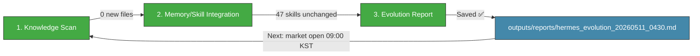

# 🧬 Hermes Auto Evolution Report — 2026-05-11 04:30

## Overview

| Metric | Value |
|--------|-------|
| New documents scanned | **0** (since 02:30 cycle) |
| New skills absorbed | **0** |
| Skills cumulative | **47** (unchanged) |
| Last skill absorption | 2026-05-09 06:30 |
| Next trading session | **⏰ ~4.5h → 5/11 09:00 KST** |
| Cycle duration | ~3 min |
| Status | 🟢 **PREMARKET — Monday open day, no new knowledge since 02:30** |

---

## 1단계: 지식 흡수 스캔

### 신규 파일 (since 02:30 evo cycle)

**No new files found in any vault location:**
- `wiki/` — 275 .md files total, none newer than 02:30 report
- `10_Wiki/` — `_Index.md` timestamp bumped at 04:00 (auto-refresh), no new content documents
- `02-Knowledge/` — Daily log last entry at 00:45, no new entries since

### Knowledge Flow Status

| Source | Status | Since Last Cycle |
|--------|--------|------------------|
| `wiki/` (275 files) | ✅ No new documents | — |
| `10_Wiki/` (MCP reports, papers) | ✅ No new documents | Last MCP: 2026-05-11 00:34 (올리브영) |
| `02-Knowledge/Hermes-Daily-Log.md` | ✅ Last entry 00:45 | No change |
| `hermes_dashboard.json` | 🔴 **Stale** (5/7 00:17 content, file touched at 04:30 by cron) | NaN KOSPI, old positions remain |

### Key Takeaways Still Unfilled (from 11_01 cycle)
- `darkrishabh/agent-skills-eval` → `_To be filled during Brain Sync processing...`
- `fendouai/CodexSaver` → `_To be filled during Brain Sync processing...`
- `yt-dlp/yt-dlp` → Partial summary only

---

## 2단계: 메모리/스킬 통합

### No new skills this cycle

Zero new documents scanned → no skill absorption candidates.

### Skills Library Summary (47 total — unchanged)

| Category | Count | Status |
|----------|-------|--------|
| **Evolution Pipeline** | 6 | ✅ Stable |
| **LLM Reliability/Safety** | 5 | ✅ Stable |
| **Agent Architecture** | 4 | ✅ Stable |
| **LLM Architecture** | 3 | ✅ Stable |
| **Reasoning & Problem Gen** | 2 | ✅ Stable |
| **Agent Orchestration** | 3 | ✅ Stable |
| **Memory Systems** | 3 | ✅ Stable |
| **Tool Integration** | 4 | ✅ Stable |
| **Communication/Grounding** | 2 | ✅ Stable |
| **Code/Data** | 3 | ✅ Stable |
| **Knowledge References** | 8 | ✅ Stable |
| **Reinforcement Learning** | 1 | ✅ Stable |
| **TOTAL** | **47** | 🟢 No change |

---

## 3단계: 진화 리포트 — 시스템 상태 & 프리마켓 준비

### System Health (04:30 KST snapshot)

| Component | Status | Details |
|-----------|--------|---------|
| Hermes Gateway | ✅ OK | PID 298, ~13h uptime (since 5/10 15:44 --replace) |
| Memory | 🟢 ~54% | 4.1Gi/7.6Gi (stable post-WSL reboot) |
| Disk | 🟢 3% | 26G/1007G |
| Swap | 🟢 **2.3MiB** (near-zero) | Fully eliminated |
| Load Average | 🟢 0.23/0.18/0.21 | Idle |
| WSL Uptime | **9h 36m** | Since 5/10 19:00 reboot — stable |
| Dashboard JSON | 🔴 **Stale (5/7 data)** | Content has NaN KOSPI, old 459510.KQ position (should be 100% cash) |
| MCP Servers | ✅ 5+ functional | All services normal |
| MetaClaw | ✅ OK | Port 30000, PID 3626 |
| OpenWebUI | ✅ OK | Port 3000, PID 307 |
| Jongdari Battleloop | ✅ OK | 10-min cycle, last complete at 00:40 |
| CowAgent/OpenDesign (Trinity) | ⚠️ tmux alive, services down | Unchanged |
| 가상오피스 (port 8001) | ✅ OK | uvicorn running, PID 76154 |

### Gap Analysis Update

| # | Gap | Status | Note |
|:-:|:-----|:--------|:------|
| #1 | Automated safety gate (constraint_decay_awareness) | 🟡 Unimplemented | Skill exists (5/9), not wired into code gen pipeline |
| #2 | Recursive sub-agent spawning (RAO) | 🟡 Unimplemented | Skill exists (5/9), evolution still single-threaded |
| #3 | Dashboard JSON stale (last 5/7) | 🔴 **4+ days stale** | Content outdated — NaN, old positions, wrong portfolio |
| #4 | Tavily API key expired | 🔴 Unresolved | Search/intel broken (day 12) |
| #5 | yfinance .KS ticker error | 🔴 Unresolved | KOSPI=NaN issue (day 12) |
| #6 | KiwoomAuth 8050 | 🔴 Unresolved | Auth failure (day 12) |
| #7 | MCP Python Zombie instances | 🔴 Unresolved | 5-6 zombie instances |
| #8 | Trinity (CowAgent/OpenDesign) | 🔴 Services down | tmux sessions alive only |

### Market State — Premarket Monday 5/11

| Indicator | Value | Technical State |
|-----------|-------|-----------------|
| **KOSPI** | **7,498.00** (5/8 close) | RSI 91.7 과매수, BB% 99.7%, 7,500선 테스트 imminent |
| **KOSDAQ** | 1,207.72 (5/8) | RSI 63.6 중립 |
| **삼성부광** | 8,980원 (+6.02%) | RSI 30.2 → 과매도 탈출, SMA20(9,847) 회복 관찰 |
| **에이치엘사이언스** | 17,700원 (+4.49%) | RSI 34.2 과매도 탈출 |
| **USD/KRW** | 1,461.48 | RSI 48.5 중립 |
| **WTI Crude** | $95.42 | RSI 56.9 중립, 주간 -10.33% 후 $95선 |
| **CB Score** | **22/100** | 공포 영역 (이전 30→22, 소폭 악화) |
| **Portfolio** | **100% cash** (₩4,929,810) | Ready for today's open |

### Key Insights

1. 🟢 **No new knowledge since 02:30** — Overnight quiet period.
2. 🟢 **System stable across all core services** — Gateway, MCP, MetaClaw, OpenWebUI, Jongdari all functional.
3. 🟢 **Swap fully eliminated** (2.3MiB effectively zero) — memory pressure resolved after WSL reboot.
4. 🟢 **Portfolio 100% cash** (₩4,929,810) — ready for today's 09:00 KST open.
5. 🔴 **Dashboard JSON still stale (4+ days)** — `hermes_dashboard.json` has NaN KOSPI, shows old 459510.KQ position (liquidated 5/7), and outdated cash balance. Content needs full rewrite before market open.
6. 🔴 **6 critical issues at day 12** — All unresolved, all carried from prior cycles. No progress.
7. 🔴 **Brain Sync Key Takeaways unfilled** — 3 documents from prior cycles still have `_To be filled...` placeholders.

### Action Items for Monday 5/11 (Market Open Day)

| Priority | Action | Target |
|----------|--------|--------|
| 🥇 | **Refresh hermes_dashboard.json** with 5/8 definitive data (KOSPI 7,498, 100% cash ₩4,929,810, no positions) | **Before 09:00 KST** ⚠️ |
| 🥇 | Monitor KOSPI 7,500 test at open — RSI 91.7 suggests possible correction/pullback | 5/11 09:00 |
| 🥇 | Monitor 삼성부광 post-5/8 +6.02% continuation or profit-taking at open | 5/11 09:00 |
| 🥈 | Wire **constraint_decay_awareness** into code gen safety gate | Week of 5/11 |
| 🥈 | Apply **recursive_agent_optimization** to evolution pipeline | Week of 5/11 |
| 🥉 | Renew **Tavily API key** for search restoration | ASAP |
| 🥉 | Attempt MCP zombie cleanup (`kill` stale Python processes) | 5/11 |
| 🥉 | Re-attempt Trinity (CowAgent/OpenDesign) service recovery | 5/11 |

---

### Hermes Evolution Status (04:30 KST, Day 12 — Market Open Day)

*Generated by Hermes Auto Evolution Engine | DeepSeek-Chat backend | Cycle 2026-05-11_0430 | Status: 🟢 PREMARKET — Monday open day, no new knowledge, system stable, 4.5h to market open*
