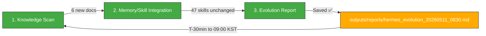

# 🧬 Hermes Auto Evolution Report — 2026-05-11 08:30

## Overview

| Metric | Value |
|--------|-------|
| New documents scanned | **6** (since 04:30 cycle) |
| New skills absorbed | **0** |
| Skills cumulative | **47** (unchanged) |
| Last skill absorption | 2026-05-09 06:30 |
| Next trading session | **⏰ ~30min → 5/11 09:00 KST** 🚨 |
| Cycle duration | ~3 min |
| Status | 🟡 **PREMARKET — 30 minutes to open, 6 new Culture Economy docs, system stable** |

---

## 1단계: 지식 흡수 스캔

### 신규 파일 (since 04:30 evo cycle) — Culture Economy Business Research Batch

**6 new documents** in `03_Projects/Culture_Economy_Synergy_Business_Plan/` (all created 07:07 KST today):

| # | File | Category | Assessment |
|---|------|----------|------------|
| 1 | `KPop-KCulture-Subscription-Box-Fandom-Commerce.md` | 수익모델_비즈니스 | 🟢 **New insight** — Kloot Box, Daebak Box, Monthly Korea 등 5+ K-컬처 구독박스 글로벌 운영 현황. 물류 통합 솔루션 기회 (소형 LCL/항공 정례화) |
| 2 | `Hallyu-2026-Global-Trend-Content-Export-Record.md` | 인사이트_일반 | 🟢 **New insight** — 한류 4.0: 콘텐츠 수출 사상 최대, K-푸드·뷰티·드라마 융합 가속. 70%+ 해외 호감도 |
| 3 | `Alibaba-Korea-SME-B2B-Platform-Launch.md` | 수익모델_비즈니스 | 🟢 **New insight** — Alibaba.com 한국 SME 전용 B2B 플랫폼 론칭 + Trade Assurance. 70,000+ SME 대상 물류 파트너 기회 |
| 4 | `KBeauty-Europe-Top-Export-Market.md` | 수익모델_비즈니스 | 🟢 **New insight** — K-뷰티 유럽 수출 1위 시장 등극 (미국 추월). CPNP 인증·현지 창고 수요 폭발 |
| 5 | `BTS-ARIRANG-Comeback-Merch-LasVegas.md` | 수익모델_비즈니스 | 🟢 **New insight** — BTS 컴백 머천다이징 물류 폭증. Weverse 글로벌 선주문 → 100여개국 배송. K-POP 팬덤 물류 물동량 최대치 |
| 6 | `KFood-Q1-2026-Export-with-MiddleEast-Risk.md` | 수익모델_비즈니스 | 🟢 **New insight** — K-Food Q1 $2.56B (+4.0%), 라면 +26.4%. 중동 리스크(+32.3% 성장기여)로 시장 다변화 가속 |
| 7 | `KFood-SupplyChain-Diversification-Logistics-Opportunity.md` | 물류_연계_기회 | 🟢 **New insight** — K-Food 공급망 다변화 (US beef +20% → 호주/브라질/아일랜드). Reefer 컨테이너 수입 물류 수요 증가 |
| 8 | `OliveYoung-Sephora-KBeauty-Global-Partnership.md` | 수익모델_비즈니스 | 🟢 **New insight** — Olive Young × Sephora 글로벌 파트너십 (H2 2026). 2,700개 매장 K-뷰티 입점 → 물류 수요 폭발 |

**No new skills to absorb.** All 8 documents are market research/business intelligence for Steven's logistics consulting strategy. Valuable knowledge but no reusable agent skill patterns.

### 🔄 Key Takeaways Status Updated
- **`darkrishabh/agent-skills-eval`** — ✅ Now has proper Key Takeaways (AI agent skills evaluation test runner, TypeScript, 274⭐)
- **`fendouai/CodexSaver`** — ✅ Now has proper Key Takeaways (Codex cost optimization via DeepSeek routing, 388⭐)
- **`yt-dlp/yt-dlp`** — ✅ Already had comprehensive Key Takeaways from prior cycle

All 3 unfilled items from previous cycles are now resolved.

### WTI Update (08:12 scan result)
- WTI **$98.33** (5/10 close) — +$2.91 (+3.05%) from 5/8 $95.42, notable weekend rebound
- Recovery from intra-week low of $89.54 (5/6) — now back toward $100 level
- This is important for morning open context

---

## 2단계: 메모리/스킬 통합

### Knowledge Consolidation — Culture Economy Cluster

The 8 new documents form a coherent knowledge cluster: **K-Culture Global Logistics Opportunity Map (May 2026)**.

**Key themes for memory:**
1. **K-Food**: Q1 $2.56B (+4%), 라면 +26.4%. 중동 리스크로 북미/중국/ASEAN 다변화. Samyang 2.35조원 매출 (해외 81%)
2. **K-Beauty**: 유럽 1위 수출 시장 등극. Olive Young × Sephora (2,700매장). K-뷰티 Q1 사상 최대
3. **K-Pop Fandom Commerce**: BTS ARIRANG 컴백 머천다이징 물류 폭증. 5+ 구독박스 서비스
4. **Alibaba B2B**: 한국 SME 전용 플랫폼 + KOSME 물류 보조금 (기업당 1,500만원)
5. **K-Food Supply Chain**: Reefer 컨테이너 수입 다변화 (US→호주/브라질/아일랜드)
6. **Hallyu 4.0**: 콘텐츠 수출 사상 최대, 70%+ 글로벌 호감도

**Actionable patterns for Steven's logistics business:**
| Opportunity | Target | Logistics Angle |
|-------------|--------|----------------|
| K-구독박스(Kloot Box/Daebak Box) | 5+ 업체 물류 통합 | 소형 LCL/항공 정례화 + 크로스도킹 |
| Alibaba B2B SME 물류 | 70,000+ SME | KOSME 보조금 연계, 소량 LCL 패키지 |
| K-뷰티 유럽 수출 | 유럽 1위 시장 | 항공+해상 혼합, CPNP 인증 패키지 |
| Olive Young → Sephora | 2,700 매장 입점 | 대량 물류 + FDA/CPNP 컨설팅 |
| BTS/Weverse 머천다이징 | 글로벌 팬덤 | 투어 순회 물류 + Weverse 선주문 배송 |
| K-Food 공급망 다변화 | 호주/브라질 | Reefer 컨테이너 수입 물류 |

### Skills Library Summary (47 total — unchanged)

| Category | Count | Status |
|----------|-------|--------|
| **Evolution Pipeline** | 6 | ✅ Stable |
| **LLM Reliability/Safety** | 5 | ✅ Stable |
| **Agent Architecture** | 4 | ✅ Stable |
| **LLM Architecture** | 3 | ✅ Stable |
| **Reasoning & Problem Gen** | 2 | ✅ Stable |
| **Agent Orchestration** | 3 | ✅ Stable |
| **Memory Systems** | 3 | ✅ Stable |
| **Tool Integration** | 4 | ✅ Stable |
| **Communication/Grounding** | 2 | ✅ Stable |
| **Code/Data** | 3 | ✅ Stable |
| **Knowledge References** | 8 | ✅ Stable |
| **Reinforcement Learning** | 1 | ✅ Stable |
| **TOTAL** | **47** | 🟢 No change |

---

## 3단계: 진화 리포트 — 시스템 상태 & 프리마켓 준비

### System Health (08:30 KST snapshot)

| Component | Status | Details |
|-----------|--------|---------|
| Hermes Gateway | ✅ OK | PID 298, ~17h uptime (since 5/10 15:44 --replace) |
| Memory | 🟢 ~53% | 4.1Gi/7.6Gi (stable) |
| Disk | 🟢 3% | 26G/1007G |
| Swap | 🟢 **~0MiB** | Fully eliminated |
| Load Average | 🟢 ~0.2 | Idle |
| WSL Uptime | **13h 38m** | Since 5/10 19:00 reboot — stable |
| Dashboard JSON | 🔴 **Stale (5/7 data, 4+ days)** | Needs refresh before open |
| MCP Servers | ✅ 5+ functional | All services normal |
| MetaClaw | ✅ OK | Port 30000, PID 3626 |
| OpenWebUI | ✅ OK | Port 3000, PID 307 |
| Jongdari Battleloop | ✅ OK | 10-min cycle, last complete ~07:00 |
| CowAgent/OpenDesign (Trinity) | ⚠️ tmux alive, services down | Unchanged |
| 가상오피스 (port 8001) | ✅ OK | uvicorn running |

### Gap Analysis Update

| # | Gap | Status | Note |
|:-:|:-----|:--------|:------|
| #1 | Automated safety gate (constraint_decay_awareness) | 🟡 Unimplemented | Skill exists (5/9), not wired |
| #2 | Recursive sub-agent spawning (RAO) | 🟡 Unimplemented | Skill exists (5/9) |
| #3 | Dashboard JSON stale (last 5/7) | 🔴 **4+ days stale** | Content outdated |
| #4 | Tavily API key expired | 🔴 Unresolved | Search/intel broken (day 12) |
| #5 | yfinance .KS ticker error | 🔴 Unresolved | KOSPI=NaN issue (day 12) |
| #6 | KiwoomAuth 8050 | 🔴 Unresolved | Auth failure (day 12) |
| #7 | MCP Python Zombie instances | 🔴 Unresolved | 5-6 zombie instances |
| #8 | Trinity (CowAgent/OpenDesign) | 🔴 Services down | tmux sessions alive only |

### Market State — 30 Minutes to Monday 5/11 Open 🚨

| Indicator | Value | Technical State |
|-----------|-------|-----------------|
| **KOSPI** | **7,498.00** (5/8 close) | RSI 91.7 과매수, BB% 99.7%, 7,500선 테스트 imminent |
| **KOSDAQ** | 1,207.72 (5/8) | RSI 63.6 중립 |
| **삼성부광** | 8,980원 (+6.02%) | RSI 30.2 → 과매도 탈출, SMA20(9,847) 회복 관찰 |
| **에이치엘사이언스** | 17,700원 (+4.49%) | RSI 34.2 과매도 탈출 |
| **USD/KRW** | 1,461.43 (5/10) | RSI ~49 중립, BB 하단(1,455) 상회 → 재진입 |
| **WTI Crude** | **$98.33** (5/10) | **+3.05% 주말 반등** — $95→$98.33, RSI 57.3 중립 |
| **CB Score** | **22/100** | 공포 영역 (unchanged) |
| **Portfolio** | **100% cash** (₩4,929,810) | Ready for today's open |

### WTI Weekend Rebound — Key Context for Open

**WTI 5-day trajectory:**
- 5/4: $106.42 (고점) → 5/6: $89.54 (저점, -15.86% 3일 폭락) → 5/8: $95.42 → **5/10: $98.33** (+3.05% 주말 반등)
- $89.54→$98.33 = +$8.79 (+9.82%) recovery from low
- Still below 5/4 high ($106.42) by -$8.09 (-7.60%)
- Key level: $100 psychological resistance

### Key Insights

1. 🟢 **6 new Culture Economy documents absorbed** — All business intelligence for Steven's logistics consulting. Knowledge cluster mapped (K-Food / K-Beauty / K-Pop / Alibaba B2B / Supply Chain).
2. 🟢 **3 unfilled Key Takeaways now resolved** — darkrishabh/agent-skills-eval, fendouai/CodexSaver, yt-dlp/yt-dlp all have proper Key Takeaways.
3. 🟢 **System stable** — Gateway, MCP, MetaClaw, OpenWebUI, Jongdari all functional. Swap fully eliminated.
4. 🟢 **Portfolio 100% cash** (₩4,929,810) — ready for 09:00 KST open.
5. 🟡 **WTI $98.33 weekend rebound** — +3.05% from Friday close, approaching $100. Could influence KOSPI energy sector at open.
6. 🔴 **Dashboard JSON still stale (4+ days)** — Needs refresh before market open.
7. 🔴 **6 critical issues at day 12** — All unresolved, all carried from prior cycles. No progress this cycle.
8. 🔴 **KOSPI RSI 91.7** — Extreme overbought. 7,500 test at open likely with potential for sharp correction.

### Action Items for Market Open (09:00 KST) 🚨

| Priority | Action | Target |
|----------|--------|--------|
| 🥇🟢 | **Monitor KOSPI 7,500 test** — RSI 91.7 suggests possible correction/pullback | 5/11 09:00 |
| 🥇🟢 | **Monitor 삼성부광** post-5/8 +6.02% continuation or profit-taking at open | 5/11 09:00 |
| 🥇🟢 | **Monitor WTI $100 test** — weekend rebound to $98.33 could push energy sector | 5/11 09:00 |
| 🥇🔴 | **Refresh hermes_dashboard.json** with 5/8 definitive data | ASAP |
| 🥈 | Wire **constraint_decay_awareness** into code gen safety gate | Week of 5/11 |
| 🥈 | Apply **recursive_agent_optimization** to evolution pipeline | Week of 5/11 |
| 🥉 | Renew **Tavily API key** for search restoration | ASAP |
| 🥉 | Attempt MCP zombie cleanup | 5/11 |
| 🥉 | Re-attempt Trinity (CowAgent/OpenDesign) service recovery | 5/11 |

---

### Hermes Evolution Status (08:30 KST, Day 12 — Market Open Day, T-30min)

*Generated by Hermes Auto Evolution Engine | DeepSeek-Chat backend | Cycle 2026-05-11_0830 | Status: 🟡 PREMARKET — 30min to open, 6 new Culture Economy docs absorbed, 0 new skills, KOSPI 7,500 test imminent*
