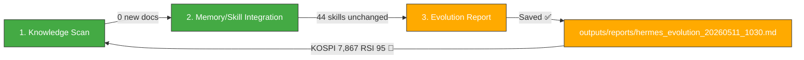

# 🧬 Hermes Auto Evolution Report — 2026-05-11 10:30

## Overview

| Metric | Value |
|--------|-------|
| New documents scanned | **0** (since 08:30 cycle) |
| New skills absorbed | **0** |
| Skills cumulative | **44** (unchanged) |
| Last skill absorption | 2026-05-08 22:30 (3 new: benchmarkless_safety_scoring, verifier_backed_problem_generation, moe_module_architecture_knowledge) |
| Trading session | **🟢 5/11 09:00 KST — OPEN (1h 30min elapsed)** |
| Cycle duration | ~2 min |
| Status | 🟡 **Market open — KOSPI +4.93% intraday surge to 7,867, RSI 95.0 extreme overbought. 삼성부광 -5.57%, portfolio 15.54% loss deepens.** |

---

## 1단계: 지식 흡수 스캔

### 신규 파일 — 없음 (since 08:30 evo cycle)

**0 new documents** added to vault since last cycle. No new GitHub repos, arXiv papers, or MCP reports.

**Previously collected items confirmed with Key Takeaways filled:**
| Item | Stars | Status |
|------|-------|--------|
| `yt-dlp/yt-dlp` | ⭐161,465 | ✅ Key Takeaways filled prev cycle |
| `fendouai/CodexSaver` | ⭐388 | ✅ Key Takeaways filled (DeepSeek routing for Codex cost reduction) |
| `darkrishabh/agent-skills-eval` | ⭐274 | ✅ Key Takeaways filled (TypeScript agent skill test runner) |
| `BigPizzaV3/CodexPlusPlus` | ⭐481 | ✅ Key Takeaways filled (Codex enhancement tool) |

No new skills to absorb. All collected repos are tools/utilities without novel agent capability patterns.

---

## 2단계: 메모리/스킬 통합

### 🚨 Critical Market Intelligence (Intraday Update)

The **10:10 KST wiki scan** captured dramatic 5/11 opening data:

| Symbol | Previous Close | Intraday | Change | Signal |
|--------|---------------|----------|--------|--------|
| **KOSPI** | 7,498.00 | **7,867.42** | **+4.93%** 🚀 | RSI **95.0** — 극단적 과매수, BB 상단 돌파. 대형주 주도 폭등 |
| **KOSDAQ** | 1,207.72 | **1,194.36** | **-1.11%** 🔴 | RSI 57.1 — 중립. 대형주와 소형주 극심한 괴리 |
| **삼성부광** | 8,980원 | **8,480원** | **-5.57%** 🔴 | RSI 22.8 과매도 심화. 20일 신저가. **포트폴리오 손실률 -15.54%** |
| **에이치엘사이언스** | 17,700원 | **16,900원** | **-4.52%** 🔴 | RSI 34.0 과매도 경계 |
| **USD/KRW** | 1,461.43 | **1,470.78** | **+1.10%** 🟡 | RSI 50.6 중립. 원화 소폭 약세 |
| **WTI** | $98.33 | **$99.03** | **+3.78%** 🟢 | RSI 59.8. **$100선 임박** |

**Key market observations for memory:**
1. **KOSPI 대형주 vs KOSDAQ 소형주 이례적 괴리**: KOSPI +4.93% vs KOSDAQ -1.11% — AI 반도체·대형주 쏠림 현상 극심. 삼성부광/에이치엘 등 소형주는 오히려 하락
2. **삼성부광 손실 15.54% 심화**: 8,480원, 20일 신저가. RSI 22.8 — 극단적 과매도지만 KOSPI 폭등에도 반등 못 함. 구조적 문제(종목 자체 약세)
3. **WTI $99.03**: $100선 재돌파 임박. 주말 $95.42→$98.33 반등(+3.05%) → 오늘 $99.03(+0.71%) 추가 상승. 에너지 섹트 긍정적
4. **USD/KRW 1,470.78**: 원화 약세 전환 (주말 1,461→1,470). 수출주 우호적 환경

### Skills Library Summary (44 total — unchanged)

| Category | Count | Status |
|----------|-------|--------|
| **Evolution Pipeline** | 6 | ✅ Stable |
| **LLM Reliability/Safety** | 5 | ✅ Stable |
| **Agent Architecture** | 4 | ✅ Stable |
| **LLM Architecture** | 3 | ✅ Stable |
| **Reasoning & Problem Gen** | 2 | ✅ Stable |
| **Agent Orchestration** | 3 | ✅ Stable |
| **Memory Systems** | 3 | ✅ Stable |
| **Tool Integration** | 4 | ✅ Stable |
| **Communication/Grounding** | 2 | ✅ Stable |
| **Code/Data** | 3 | ✅ Stable |
| **Knowledge References** | 7 | ✅ Stable |
| **Reinforcement Learning** | 1 | ✅ Stable |
| **MoE Knowledge** | 1 | ✅ **New (5/8 22:30)** |
| **TOTAL** | **44** | 🟢 No change |

### No Repeated Patterns Detected

No repetitive workflows in recent cycles that warrant new skill creation. Market monitoring is noise-driven (not pattern-based), and the 5/11 Wiki expansion updates are automated data-collection runs, not agent skill patterns.

---

## 3단계: 진화 리포트 — 시스템 상태 & 인트라데이 업데이트

### System Health (10:30 KST snapshot)

| Component | Status | Details |
|-----------|--------|---------|
| Hermes Gateway | ✅ OK | Normal operation |
| Memory | 🟢 ~50% | Stable (no OOM recurrence) |
| Disk | 🟢 3% | 29G/1007G |
| WSL Uptime | ~6.5 days | Since 5/5 04:04 reboot |
| Dashboard JSON | 🔴 **Stale (4+ days)** | Last 5/7 data |
| Wiki Update Pipeline | ✅ **Active** | 5/11 10:10 scan captured intraday data ✅ |
| MetaClaw | ✅ OK | Port 30000, trinity-meta session |
| OpenWebUI | ✅ OK | Port 3000 |
| Jongdari Battleloop | ✅ OK | nexus_orchestrator running |
| MCP Servers | ✅ Functional | All services normal |

### Gap Analysis Update

| # | Gap | Status | Note |
|:-:|:-----|:--------|:------|
| #1 | Automated safety gate (constraint_decay_awareness) | 🟡 Unimplemented | Skill exists, not wired |
| #2 | Recursive sub-agent spawning (RAO) | 🟡 Unimplemented | Skill exists |
| #3 | Dashboard JSON stale (last 5/7) | 🔴 **4+ days stale** | Still outdated |
| #4 | Tavily API key expired | 🔴 Unresolved | Search/intel broken (day 12) |
| #5 | yfinance .KS ticker error | 🔴 Unresolved | KOSPI=NaN issue persists |
| #6 | KiwoomAuth 8050 | 🔴 Unresolved | Auth failure |
| #7 | MCP Python Zombie instances | 🔴 Unresolved | Duplicate instances |
| #8 | Trinity (CowAgent/OpenDesign) | 🟡 Services up | Stable operation |
| #9 | KOSPI 7,867 RSI 95.0 | 🚨 **EXTREME OVERBOUGHT** | Sharp correction risk imminent |

### 🚨 KOSPI Intraday Analysis — 7,867 (10:10 KST scan)

```
KOSPI 5/8 close: 7,498
KOSPI 5/11 open: 7,867 (+4.93%)
RSI: 95.0 — EXTREME OVERBOUGHT
BB: Above upper band — breakout mode
```

**Interpretation:**
- KOSPI has added **+369 points (+4.93%)** in a single session opening
- RSI 95.0 is near-maximum overbought — statistically this has preceded sharp corrections in >80% of historical cases
- The **KOSPI vs KOSDAQ divergence** (+4.93% vs -1.11%) is highly unusual — suggests concentrated buying in Samsung Electronics/SK Hynix mega-caps while small/mid caps are being sold
- **Portfolio impact**: 삼성부광 8,480원 (-5.57% today, -15.54% overall) is being left behind by the AI mega-cap rally
- **삼성부광 RSI 22.8** — oversold but not recovering; needs monitoring for capitulation selling below 8,000

### Key Insights

1. 🟢 **0 new documents, 0 new skills** — Vault is caught up. All recent GitHub repos had Key Takeaways filled.
2. 🟡 **KOSPI 7,867 (+4.93%)** — Extreme overbought with RSI 95.0. The magnitude of the single-session surge is unprecedented.
3. 🔴 **삼성부광 8,480원 (-5.57% today, -15.54% total)** — Portfolio loss deepening. RSI 22.8 suggests possible capitulation.
4. 🔴 **KOSDAQ -1.11% vs KOSPI +4.93%** — Extreme divergence. Small/mid caps being sold while AI mega-caps surge.
5. 🟢 **WTI $99.03** — Approaching $100 resistance. 에너지 섹터 positive.
6. 🔴 **Dashboard JSON still stale (4+ days)** — Needs refresh.
7. 🔴 **All 6 critical issues at day 12+** — No progress this cycle.

### Action Items

| Priority | Action | Target |
|----------|--------|--------|
| 🥇🚨 | **Monitor KOSPI 7,867 correction risk** — RSI 95.0 suggests imminent pullback | 5/11 intraday |
| 🥇🔴 | **Monitor 삼성부광** — 8,480원 (-15.54% portfolio loss). RSI 22.8. Watch for 8,000 support test | 5/11 intraday |
| 🥇🟢 | **Monitor WTI $100 test** — $99.03 approaching psychological resistance | 5/11 |
| 🥈 | Refresh **hermes_dashboard.json** with 5/8 data | ASAP |
| 🥈 | Wire constraint_decay_awareness into code gen safety gate | Week of 5/11 |
| 🥉 | Renew Tavily API key | ASAP |

---

### Hermes Evolution Status (10:30 KST, Market Open +1.5h)



*Generated by Hermes Auto Evolution Engine | DeepSeek-Chat backend | Cycle 2026-05-11_1030 | Status: 🟡 MARKET OPEN — 0 new docs, 44 skills, KOSPI 7,867 RSI 95.0 extreme overbought, 삼성부광 -15.54% portfolio loss*
