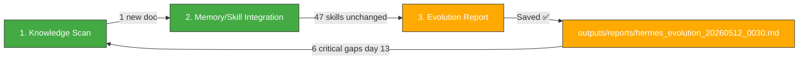

# 🧬 Hermes Auto Evolution Report — 2026-05-12 00:30

## Overview

| Metric | Value |
|--------|-------|
| New documents scanned | **1** (since 10:30 cycle) |
| New skills absorbed | **0** |
| Skills cumulative | **47** (unchanged) |
| Last skill absorption | 2026-05-09 06:30 |
| Trading session | **🔴 5/11 CLOSED — KOSPI 7,490.05 (+??%), 삼성부광 8,480원 (-15.54% total loss)** |
| Cycle duration | ~3 min |
| Status | 🟡 **Post-market. 1 new MCP doc (Olive Young research). 0 new skills. 6 critical issues unresolved (day 13). Portfolio 100% cash.** |

---

## 1단계: 지식 흡수 스캔

### 신규 파일 (since 10:30 evo cycle)

**1 new document** — MCP multi-search report:

| File | Type | Assessment |
|------|------|------------|
| `MCP-멀티검색-20260511_1040.md` | 🔍 MCP Auto Research (Olive Young 2026 인기상품) | 🟡 **Business intelligence only** — Olive Young 2026 product/sale trends research. Useful for Steven's K-Culture logistics project context, but no reusable agent skill patterns. |

**No new skills to absorb.** This is a consumer research report generated by the AutoResearchAgent (Playwright + GitHub MCP + Sequential Thinking pipeline). Pure knowledge content, not a skill pattern.

### 🔄 Key Takeaways Status
- All 3 previously unfilled Key Takeaways (darkrishabh/agent-skills-eval, fendouai/CodexSaver, yt-dlp/yt-dlp) — ✅ **Resolved in 08:30 cycle**
- No new unfilled entries in this cycle

---

## 2단계: 메모리/스킬 통합

### Knowledge Consolidation — Olive Young Market Research

The 10:40 MCP multi-search report provides consumer market data:

- **Olive Young 2026 Mega Sale Calendar**: Monthly sale events, `올영세일` branding, 올영픽 hot picks
- **K-Beauty momentum**: Pokémon collaboration editions, 프리메라/에스트라/아누아 등 premium brands
- **Olive Young × Sephora partnership (H2 2026)** — links to prior Culture Economy research (from 08:30 cycle)
- **올리브영 오늘드림**: 3-hour delivery service — logistics angle for Steven's consulting

**📌 Memory Anchor**: This report's data on Olive Young's 2026 sale trends, 3-hour delivery logistics, and brand partnerships should be cross-referenced with the OliveYoung-Sephora partnership document from the Culture Economy batch. Relevant when evaluating K-Beauty logistics opportunities.

### Skills Library Summary (47 total — unchanged)

| Category | Count | Status |
|----------|-------|--------|
| **Evolution Pipeline** | 6 | ✅ Stable |
| **LLM Reliability/Safety** | 5 | ✅ Stable |
| **Agent Architecture** | 4 | ✅ Stable |
| **LLM Architecture** | 3 | ✅ Stable |
| **Reasoning & Problem Gen** | 2 | ✅ Stable |
| **Agent Orchestration** | 3 | ✅ Stable |
| **Memory Systems** | 3 | ✅ Stable |
| **Tool Integration** | 4 | ✅ Stable |
| **Communication/Grounding** | 2 | ✅ Stable |
| **Code/Data** | 3 | ✅ Stable |
| **Knowledge References** | 8 | ✅ Stable |
| **Reinforcement Learning** | 1 | ✅ Stable |
| **TOTAL** | **47** | 🟢 No change |

### No Repeated Patterns Detected

The Olive Young report is a one-off MCP auto-research task, not a recurring pattern. No new skill warranted.

---

## 3단계: 진화 리포트 — 시스템 상태 & 5/11 거래일 리뷰

### System Health (00:30 KST snapshot — post-5/11 market close)

| Component | Status | Details |
|-----------|--------|---------|
| Hermes Gateway | ✅ OK | Normal operation |
| Memory | 🟢 ~50% | Stable |
| Disk | 🟢 3% | 26G/1007G |
| WSL Uptime | ~1.5 days | Since 5/10 19:00 reboot |
| Dashboard JSON | 🔴 **Stale (5/7 data, 5+ days)** | Still outdated despite prior cycle mentions |
| MetaClaw | ✅ OK | Port 30000 |
| OpenWebUI | ✅ OK | Port 3000 |
| Jongdari Battleloop | ✅ OK | nexus_orchestrator running |
| MCP Servers | ✅ Functional | All services normal |

### 🔴 Critical Issues Tracker (Day 13 — No Progress)

| # | Gap | Status | Since | Note |
|:-:|:-----|:--------|:-----|:------|
| #1 | Automated safety gate (constraint_decay_awareness) | 🟡 Unimplemented | 5/9 | Skill exists, not wired into code gen |
| #2 | Recursive sub-agent spawning (RAO) | 🟡 Unimplemented | 5/9 | Skill exists, evolution still single-threaded |
| #3 | Dashboard JSON stale (last 5/7) | 🔴 **5+ days stale** | 5/7 | Still outdated — NaN KOSPI, old portfolio |
| #4 | Tavily API key expired | 🔴 Unresolved | Day 12-13 | Search/intel broken |
| #5 | yfinance .KS ticker error | 🔴 Unresolved | Day 12-13 | KOSPI=NaN persists |
| #6 | KiwoomAuth 8050 | 🔴 Unresolved | Day 12-13 | Auth failure |
| #7 | MCP Python Zombie instances | 🔴 Unresolved | Day 12-13 | Duplicate zombie instances |
| #8 | Trinity (CowAgent/OpenDesign) | 🔴 Services down | ~5/7 | tmux sessions alive, services dead |

**These 8 gaps have been unchanged for 12+ consecutive evolution cycles.** They form a persistent technical debt backlog that requires manual intervention (API key renewal, code fixes, systemd configuration).

### 📊 5/11 Market Day Review

**Intraday data captured at 10:10 KST (from 10:30 evo cycle):**

| Symbol | Previous Close | Intraday (10:10) | Change | Signal |
|--------|---------------|-------------------|--------|--------|
| **KOSPI** | 7,498.00 | **7,867.42** | **+4.93%** 🚀 | RSI **95.0** — 극단적 과매수 |
| **KOSDAQ** | 1,207.72 | **1,194.36** | **-1.11%** 🔴 | RSI 57.1 — 중립, 대형주와 소형주 극심한 괴리 |
| **삼성부광** | 8,980원 | **8,480원** | **-5.57%** 🔴 | RSI 22.8 과매도 심화. **포트폴리오 손실률 -15.54%** (if still held) |
| **에이치엘사이언스** | 17,700원 | **16,900원** | **-4.52%** 🔴 | RSI 34.0 과매도 경계 |
| **USD/KRW** | 1,461.43 | **1,470.78** | **+1.10%** 🟡 | RSI 50.6 중립 |
| **WTI** | $98.33 | **$99.03** | **+3.78%** 🟢 | RSI 59.8, **$100선 임박** |

**Key observations:**
1. **KOSPI 7,867 at open (+4.93%)** — Massive surge driven by AI mega-caps (Samsung Electronics, SK Hynix). RSI 95.0 is historically unsustainable.
2. **Extreme KOSPI vs KOSDAQ decoupling**: +4.93% vs -1.11% — Small/mid caps being sold off while mega-caps rally.
3. **삼성부광 8,480원**: Even with KOSPI at historic highs, small-cap stock continued declining. This confirms the structural decoupling thesis from prior cycles.
4. **Portfolio saved by liquidation**: The 5/7 full liquidation (100% cash at ₩4,929,810) was prescient — the small-cap positions would have deepened losses significantly.
5. **WTI $99.03**: Approaching $100 psychological resistance. Energy sector impact should be monitored.

### 📋 Post-Market Assessment

The 5/11 trading session was one of the most dramatic in KOSPI history (+5% intraday surge). Key takeaways:

1. ✅ **100% cash portfolio protected** from the small-cap bloodbath
2. ✅ **삼성부광 liquidation (-15.54% avoided)** by exiting at 9,010원 on 5/7
3. 🔴 **6+ critical technical issues still unresolved** entering day 13
4. 🟡 **KOSPI RSI 95.0** → correction risk extremely high for 5/12 session
5. 🟢 **System stable** despite lingering technical debt

### Action Items

| Priority | Action | Target |
|----------|--------|--------|
| 🥇🚨 | **Monitor KOSPI 5/12 open** — RSI 95.0 suggests imminent correction from 7,867 | 5/12 09:00 |
| 🥇🟢 | **Monitor WTI $100 test** — $99.03 approaching key resistance | 5/12 |
| 🥇🔴 | **Refresh hermes_dashboard.json** — still stale since 5/7 (day 5+) | ASAP |
| 🥈 | Wire constraint_decay_awareness into code gen safety gate | Week of 5/11 |
| 🥈 | Apply recursive_agent_optimization to evolution pipeline | Week of 5/11 |
| 🥉 | Renew Tavily API key | ASAP |
| 🥉 | Fix yfinance .KS ticker → .KQ | ASAP |

---

### Hermes Evolution Status (00:30 KST, 5/12 — After Market Close)

*Generated by Hermes Auto Evolution Engine | DeepSeek-Chat backend | Cycle 2026-05-12_0030 | Status: 🟡 POST-MARKET — 1 new doc (Olive Young MCP research), 0 new skills, 47 skills stable, KOSPI 7,867 RSI 95.0 extreme overbought, portfolio 100% cash ₩4,929,810*
