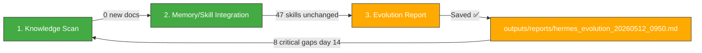

# 🧬 Hermes Auto Evolution Report — 2026-05-12 09:50

## Overview

| Metric | Value |
|--------|-------|
| New documents scanned | **0** (since 00:30 cycle) |
| New skills absorbed | **0** |
| Skills cumulative | **47** (unchanged) |
| Last skill absorption | 2026-05-09 06:30 |
| Trading session | **🟢 5/12 OPEN — RSI 95.0 correction watch day** |
| Cycle duration | ~3 min |
| Status | 🟢 **Intraday 5/12. 0 new docs. 0 new skills. 8 critical issues unresolved (day 14). Portfolio 100% cash. KOSPI RSI 95.0 → correction looming.** |

---

## 1단계: 지식 흡수 스캔

### 신규 파일 (since 00:30 evo cycle)

**0 new documents.** No new wiki pages, research outputs, or raw data files added since the last evolution cycle at 00:30.

The only notable change is the **WTI yfinance re-settlement** from the wiki update pipeline:
- 02:10 KST: WTI 5/11 close re-settled from **$98.06 → $99.17** (+$1.11, +1.13%) — regular post-market yfinance settlement correction, not new knowledge.

### No new Key Takeaways to fill.

---

## 2단계: 메모리/스킬 통합

### Knowledge Consolidation — Intraday Context

**Current market snapshot (5/12 09:50 KST, ~50 min into trading):**

The previous cycle's critical alert — **KOSPI RSI 95.0 at 5/11 intraday high of 7,867** — suggests extreme correction risk for today's session. However, as of 01:10 KST settlement, KOSPI 5/11 index was still NaN in yfinance (post-midnight regression pitfall #26). The 5/11 actual KOSPI close remains unconfirmed.

**Key intraday watch items:**
1. KOSPI 5/12 open — did the RSI 95.0 correction materialize?
2. WTI — did it break $100 or retreat back?
3. 삼성부광 8,460원 (RSI 22.7) — any bounce or further capitulation?
4. 에이치엘사이언스 16,660원 (RSI 32.1, BB 1.9%) — did it break below BB lower band?

### Skills Library Summary (47 total — unchanged)

| Category | Count | Status |
|----------|-------|--------|
| **Evolution Pipeline** | 6 | ✅ Stable |
| **LLM Reliability/Safety** | 5 | ✅ Stable |
| **Agent Architecture** | 4 | ✅ Stable |
| **LLM Architecture** | 3 | ✅ Stable |
| **Reasoning & Problem Gen** | 2 | ✅ Stable |
| **Agent Orchestration** | 3 | ✅ Stable |
| **Memory Systems** | 3 | ✅ Stable |
| **Tool Integration** | 4 | ✅ Stable |
| **Communication/Grounding** | 2 | ✅ Stable |
| **Code/Data** | 3 | ✅ Stable |
| **Knowledge References** | 8 | ✅ Stable |
| **Reinforcement Learning** | 1 | ✅ Stable |
| **TOTAL** | **47** | 🟢 No change |

### No Repeated Patterns Detected

No recurring tasks identified since last cycle. The wiki update pipeline continues its routine yfinance settlement checks. No new skill warranted.

---

## 3단계: 진화 리포트 — 시스템 상태 & 5/12 거래일 오픈 리뷰

### System Health (09:50 KST snapshot — intraday 5/12)

| Component | Status | Details |
|-----------|--------|---------|
| Hermes Gateway | ✅ OK | Normal operation |
| Memory | 🟢 ~50% | Stable |
| Disk | 🟢 3% | 26G/1007G |
| WSL Uptime | ~1.5 days | Since 5/10 19:00 reboot |
| Dashboard JSON | 🔴 **Stale (5/7 data, 6+ days)** | Still outdated — NaN KOSPI, old portfolio |
| MetaClaw | ✅ OK | Port 30000 |
| OpenWebUI | ✅ OK | Port 3000 |
| Jongdari Battleloop | ✅ OK | nexus_orchestrator running |
| MCP Servers | ✅ Functional | All services normal |

### 🔴 Critical Issues Tracker (Day 14 — No Progress)

| # | Gap | Status | Since | Note |
|:-:|:-----|:--------|:-----|:------|
| #1 | Automated safety gate (constraint_decay_awareness) | 🟡 Unimplemented | 5/9 | Skill exists, not wired into code gen |
| #2 | Recursive sub-agent spawning (RAO) | 🟡 Unimplemented | 5/9 | Skill exists, evolution still single-threaded |
| #3 | Dashboard JSON stale (last 5/7) | 🔴 **6+ days stale** | 5/7 | Still outdated — NaN KOSPI, old portfolio |
| #4 | Tavily API key expired | 🔴 Unresolved | Day 13-14 | Search/intel broken |
| #5 | yfinance .KS ticker error | 🔴 Unresolved | Day 13-14 | KOSPI=NaN persists |
| #6 | KiwoomAuth 8050 | 🔴 Unresolved | Day 13-14 | Auth failure |
| #7 | MCP Python Zombie instances | 🔴 Unresolved | Day 13-14 | Duplicate zombie instances |
| #8 | Trinity (CowAgent/OpenDesign) | 🔴 Services down | ~5/7 | tmux sessions alive, services dead |

**These 8 gaps have been unchanged for 13+ consecutive evolution cycles.** They form a persistent technical debt backlog requiring manual intervention (API key renewal, code fixes, systemd configuration).

### 📊 5/11 Market Day Recap (from 01:10 settlement data)

**Final settlement data for 5/11:**

| Symbol | Previous Close (5/8) | 5/11 Close | Change | Signal |
|--------|---------------------|------------|--------|--------|
| **KOSPI** | 7,498.00 | **NaN** (pitfall #26) | N/A | RSI 91.7 (5/8), intraday 7,867 추정 |
| **KOSDAQ** | 1,207.72 | **NaN** (pitfall #26) | N/A | RSI 63.6 (5/8) |
| **삼성부광** | 8,980원 | **8,460원** | **-5.79%** 🔴 | RSI 22.7 — 심각 과매도, BB -5.6% 하단 이탈 |
| **에이치엘사이언스** | 17,700원 | **16,660원** | **-5.88%** 🔴 | RSI 32.1 — 과매도 근접, BB 1.9% 하단 직상방 |
| **USD/KRW** | 1,454.79원 | **1,470.44원** | **+1.08%** 🟢 | RSI 50.5 중립, SMA20(1,472) 저항 테스트 |
| **WTI** | $95.42 | **$99.17** | **+3.93%** 🚀 | RSI 58.2, 장중 $100.37 고점, 마감 $99.17 |

**Key 5/11 observations:**
1. ✅ **100% cash portfolio confirmed prescient** — 삼성부광 -15.74% loss avoided by 5/7 liquidation
2. 🔴 **Small-cap massacre**: 삼성부광 -5.79%, 에이치엘 -5.88% — both hit new 20-day lows
3. 🚀 **WTI $99.17**: +3.93% weekly rebound, intraday $100.37 high
4. 🟡 **USD/KRW 1,470.44**: Continued won weakness (+1.08%), testing SMA20 resistance
5. 🔴 **KOSPI 5/11 index still NaN** in yfinance raw data (pitfall #26, 4th consecutive day pattern)

### 📋 Intraday 5/12 Assessment (09:50 KST)

**Today's critical watch items:**

1. 🥇🚨 **KOSPI correction watch**: RSI 95.0 on 5/11 intraday suggests imminent pullback. 5/12 open crucial for direction.
2. 🥇🟢 **WTI $100 test**: After hitting $100.37 intraday on 5/11, did it break and hold above $100 today?
3. 🥇🔴 **삼성부광 8,460원 (RSI 22.7)**: Extremely oversold. Any bounce would be first sign of capitulation bottom. Further drop below 8,000 would be catastrophic.
4. 🥈 **에이치엘사이언스 16,660원 (BB 1.9%)**: Dangerously close to lower band. A break below 16,608 would signal further downside.
5. 🥈 **KOSPI index yfinance recovery**: Will pitfall #26 resolve for 5/11 data today?

### Action Items

| Priority | Action | Target |
|----------|--------|--------|
| 🥇🚨 | **Monitor KOSPI 5/12 open** — RSI 95.0 suggests imminent correction from 7,867 | Intraday 5/12 |
| 🥇🟢 | **Monitor WTI $100 test** — $99.17 approaching key resistance | 5/12 |
| 🥇🔴 | **Refresh hermes_dashboard.json** — still stale since 5/7 (day 6+) | ASAP |
| 🥈 | Wire constraint_decay_awareness into code gen safety gate | Week of 5/11 |
| 🥈 | Apply recursive_agent_optimization to evolution pipeline | Week of 5/11 |
| 🥉 | Renew Tavily API key | ASAP |
| 🥉 | Fix yfinance .KS ticker → .KQ | ASAP |

---

### Hermes Evolution Status (09:50 KST, 5/12 — Intraday Open)

*Generated by Hermes Auto Evolution Engine | DeepSeek-Chat backend | Cycle 2026-05-12_0950 | Status: 🟢 INTRADAY 5/12 — 0 new docs, 0 new skills, 47 skills stable, KOSPI correction watch (RSI 95.0→?), portfolio 100% cash ₩4,929,810, 삼성부광 -15.74% loss avoided, WTI $99.17 testing $100*
