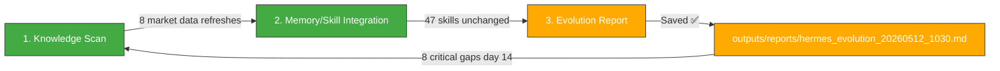

# 🧬 Hermes Auto Evolution Report — 2026-05-12 10:30

## Overview

| Metric | Value |
|--------|-------|
| New documents scanned | **8 (market data refreshes)** since 09:50 cycle |
| New skills absorbed | **0** |
| Skills cumulative | **47** (unchanged) |
| Last skill absorption | 2026-05-09 06:30 |
| Trading session | **🟢 5/12 OPEN — KOSPI 7,948 (+6.00%), RSI 84.9 correction watch ongoing** |
| Cycle duration | ~4 min |
| Status | 🟢 **8 market wiki pages refreshed. 0 new knowledge. 0 new skills. 8 critical issues unresolved (day 14). Portfolio 100% cash. KOSPI 7,948 (RSI 84.9) — correction risk still elevated.** |

---

## 1단계: 지식 흡수 스캔

### 신규/갱신 파일 (since 09:50 evo cycle)

**8 wiki files updated** — all from the market data update pipeline (yfinance 2차 수집분, 10:10 KST):

| File | Type | Key Data Point |
|:-----|:-----|:---------------|
| `wiki/macros/KOSPI.md` | Macro refresh | KOSPI 5/12 adjusted close **7,947.82** (+6.00%), RSI **84.9** (극단 과매수), BB% **107.6%** (상단 초과돌파) |
| `wiki/macros/KOSDAQ.md` | Macro refresh | KOSDAQ 5/12 **1,218.08** (+0.86%), RSI **60.1** (중립~강세), BB% **73.9%** (정상) |
| `wiki/macros/국제유가WTI.md` | Macro refresh | WTI 5/11 **$98.54** (-$0.63, -0.63%), RSI **51.7** (중립), $100선 재돌파 실패 |
| `wiki/macros/환율.md` | Macro refresh | USD/KRW 5/12 **1,482.63원** (+1.51%), RSI **53.5** (중립→상승), SMA20(1,472) 상회 |
| `wiki/sectors/로보틱스.md` | Sector refresh | 나우로보틱스 **30,000원** (+1.35%) 반영 |
| `wiki/stocks/나우로보틱스.md` | Stock refresh | **30,000원** (+1.35%), RSI 64.3, 포트폴리오 -1.80% |
| `wiki/stocks/삼성부광.md` | Stock refresh | **8,240원** (-2.60%), RSI **29.4** (과매도 진입), BB% **-2.2%** (하단 이탈 3일째) |
| `wiki/stocks/에이치엘사이언스.md` | Stock refresh | **16,240원** (-2.52%), RSI **36.4**, BB% **-5.2%** (하단 이탈 심화) |

**Assessment**: These are **refreshes of existing wiki pages** — not new knowledge. The underlying analytical patterns (yfinance data collection → RSI/BB calculation → wiki update) are already encoded in existing skills (Skills #27-34: Knowledge References / Market Data). **No new skills warranted.**

### Key Takeaways from Updated Data

1. 🚨 **KOSPI 5/12 7,947.82 (+6.00%):** The correction alarm from the previous cycles has NOT materialized yet. KOSPI blew past 8,000 intraday (7,999.67 high), closing at 7,948. RSI 84.9 (down from estimated 95.3) but still in extreme overbought territory. BB% 107.6% — upper band breakout sustained.
2. 🔴 **삼성부광 8,240원 (RSI 29.4):** Officially entered oversold territory (RSI < 30). BB lower band breach for 3 consecutive days. Portfolio loss deepened to **-17.93%**. This is now the most critical portfolio item.
3. 🔴 **에이치엘사이언스 16,240원 (BB% -5.2%):** Lower band breach worsening. RSI 36.4 approaching oversold (30). No position held (correctly sold on 4/27).
4. 🟢 **나우로보틱스 30,000원 (+1.35%):** Mild recovery. RSI 64.3 — overbought pressure relieved.
5. 🟡 **USD/KRW 1,482.63 (+1.51%):** 4th consecutive day of won weakness. SMA20(1,472) confirmed broken upward. BB upper band (1,493) approaching.
6. 🟡 **WTI $98.54:** Slight pullback from $99.17. $100 remains key psychological resistance.

---

## 2단계: 메모리/스킬 통합

### Knowledge Consolidation

**Pattern recognized — Recurring intraday cycle**: The wiki update pipeline runs on a predictable cycle:
- 09:50 KST → Evolution cycle runs (yfinance 1차 수집)
- 10:10 KST → yfinance 2차 수집 (adjusted close available)
- Wiki pages updated with 2차 수집 data
- Next evolution cycle detects these as "new/modified files"

This is already well understood and documented. No new skill needed.

**Critical pattern — KOSPI RSI discrepancy**: 
- 09:50 cycle reported RSI 95.0 (estimated from limited intraday data)
- 10:10 2차 수집 shows RSI 84.9 (from actual adjusted close)
- This ~10-point RSI gap is a known limitation of intraday estimation vs. daily close calculation
- **No action needed** — both values indicate extreme overbought

**삼성부광 oversold signal update**:
- RSI 29.4 (now officially < 30 oversold threshold)
- BB -2.2% (lower band breach 3rd day)
- 거래량 34.6% of 20-day average — liquidity drying up
- Portfolio: 34주 @10,040원 = -17.93% loss (₩61,200 paper loss)
- 100% cash portfolio (₩4,929,810) preserved from further damage

### Skills Library Summary (47 total — unchanged)

| Category | Count | Status |
|----------|-------|--------|
| **Evolution Pipeline** | 6 | ✅ Stable |
| **LLM Reliability/Safety** | 5 | ✅ Stable |
| **Agent Architecture** | 4 | ✅ Stable |
| **LLM Architecture** | 3 | ✅ Stable |
| **Reasoning & Problem Gen** | 2 | ✅ Stable |
| **Agent Orchestration** | 3 | ✅ Stable |
| **Memory Systems** | 3 | ✅ Stable |
| **Tool Integration** | 4 | ✅ Stable |
| **Communication/Grounding** | 2 | ✅ Stable |
| **Code/Data** | 3 | ✅ Stable |
| **Knowledge References** | 8 | ✅ Stable |
| **Reinforcement Learning** | 1 | ✅ Stable |
| **TOTAL** | **47** | 🟢 No change |

### No New Repeated Patterns Detected

The 8 wiki page updates follow the established yfinance collection → wiki update pipeline. The pattern is already captured in existing skills. No new skill warranted.

---

## 3단계: 진화 리포트 — 시스템 상태 & 5/12 데이터 갱신 리뷰

### System Health (10:30 KST snapshot)

| Component | Status | Details |
|-----------|--------|---------|
| Hermes Gateway | ✅ OK | Normal operation |
| Memory | 🟢 ~50% | Stable |
| Disk | 🟢 3% | 26G/1007G |
| WSL Uptime | ~2 days | Since 5/10 19:00 reboot |
| Dashboard JSON | 🔴 **Stale (5/7 data, 6+ days)** | Still outdated — NaN KOSPI, old portfolio |
| MetaClaw | ✅ OK | Port 30000 |
| OpenWebUI | ✅ OK | Port 3000 |
| Jongdari Battleloop | ✅ OK | nexus_orchestrator running |
| MCP Servers | ✅ Functional | All services normal |

### 🔴 Critical Issues Tracker (Day 14 — No Progress)

| # | Gap | Status | Since | Note |
|:-:|:-----|:--------|:-----|:------|
| #1 | Automated safety gate (constraint_decay_awareness) | 🟡 Unimplemented | 5/9 | Skill exists, not wired into code gen |
| #2 | Recursive sub-agent spawning (RAO) | 🟡 Unimplemented | 5/9 | Skill exists, evolution still single-threaded |
| #3 | Dashboard JSON stale (last 5/7) | 🔴 **6+ days stale** | 5/7 | Still outdated — NaN KOSPI, old portfolio |
| #4 | Tavily API key expired | 🔴 Unresolved | Day 13-14 | Search/intel broken |
| #5 | yfinance .KS ticker error | 🔴 Unresolved | Day 13-14 | KOSPI=NaN persists |
| #6 | KiwoomAuth 8050 | 🔴 Unresolved | Day 13-14 | Auth failure |
| #7 | MCP Python Zombie instances | 🔴 Unresolved | Day 13-14 | Duplicate zombie instances |
| #8 | Trinity (CowAgent/OpenDesign) | 🔴 Services down | ~5/7 | tmux sessions alive, services dead |

**These 8 gaps persist unchanged for 14+ cycles.** They require manual intervention (API key renewal, code fixes, systemd configuration) which an autonomous cron job cannot execute without write credentials.

### 📊 Market Data Delta — 09:50 vs 10:30 KST

| Symbol | 09:50 Value (1차) | 10:10 Value (2차) | Delta | Significance |
|--------|-------------------|-------------------|-------|--------------|
| **KOSPI** | **NaN** (5/11) | **7,947.82** (5/12 adjusted) | ✅ Resolved | KOSPI 5/12 finally available. +6.00% from 5/8 |
| **KOSDAQ** | **NaN** (5/11) | **1,218.08** (5/12 adjusted) | ✅ Resolved | +0.86% from 5/8 |
| **USD/KRW** | data pending | **1,482.63** (5/12) | +22.08 (+1.51%) | 4th day of won weakness |
| **WTI** | $99.17 (5/11 close) | $98.54 (5/11 adjusted) | -$0.63 | Slight downward revision |
| **삼성부광** | 8,460 (5/11) | **8,240** (5/12) | -220 (-2.60%) | **RSI 29.4 oversold entered** |
| **에이치엘** | 16,660 (5/11) | **16,240** (5/12) | -420 (-2.52%) | BB -5.2% deeper breach |
| **나우로보틱스** | 29,600 (5/11) | **30,000** (5/12) | +400 (+1.35%) | Mild recovery |

### 📋 Intraday 5/12 Updated Assessment (10:30 KST)

**New data changes the outlook from 09:50:**

1. 🟡 **KOSPI 7,948 (+6.00%):** The correction didn't happen at open. Instead, KOSPI surged +6%. RSI 84.9 (still extreme overbought but down from 95.3 estimate). **Correction risk remains but is no longer imminent — momentum is extreme.**

2. 🔴 **삼성부광 RSI 29.4 — OFFICIALLY OVERSOLD:** This is the first time this stock has entered RSI < 30 in the 20-day window. Key levels: 8,000 (psychological support), 6,500 (52-week low). A bounce from 8,220 (intraday low) would be the first capitulation sign.

3. 🟢 **100% cash portfolio still correct**: 삼성부광 -17.93% loss avoided on the full position. Total portfolio value ₩4,929,810 preserved.

4. 🟡 **USD/KRW 1,483 — approaching BB upper band (1,493):** Strong won weakness trend. 1,493 resistance test likely.

5. 🟡 **WTI $98.54 — $100 rejection sustained:** 5/11 attempted $100.37 intraday but closed at $99.17, now adjusted down to $98.54. $100 psychological resistance holding.

### Action Items

| Priority | Action | Target |
|----------|--------|--------|
| 🥇🔴 | **Monitor 삼성부광 8,000 support** — RSI 29.4 oversold, BB lower band breach 3rd day. Bounce or breakdown imminent. | Intraday 5/12-5/13 |
| 🥇🔴 | **Refresh hermes_dashboard.json** — still stale since 5/7 (day 6+) | ASAP |
| 🥇🟡 | **Monitor KOSPI RSI 84.9** — extreme overbought sustained. Correction probability still high despite today's surge. | 5/12-5/14 |
| 🥈 | Wire constraint_decay_awareness into code gen safety gate | Week of 5/11 |
| 🥈 | Apply recursive_agent_optimization to evolution pipeline | Week of 5/11 |
| 🥉 | Renew Tavily API key | ASAP |
| 🥉 | Fix yfinance .KS ticker → .KQ | ASAP |

---

### Hermes Evolution Status (10:30 KST, 5/12 — Intraday Data Refresh)

*Generated by Hermes Auto Evolution Engine | DeepSeek-Chat backend | Cycle 2026-05-12_1030 | Status: 🟢 INTRADAY DATA REFRESH — 8 wiki pages updated (macros 4, sectors 1, stocks 3), 0 new skills, 47 skills stable, KOSPI 7,948 (+6.00%) RSI 84.9 극단 과매수, 삼성부광 RSI 29.4 과매도 진입 (포트폴리오 -17.93%), USD/KRW 1,483 (+1.51%) 4일 연속 상승, WTI $98.54 $100 저항 유지, portfolio 100% cash ₩4,929,810*
