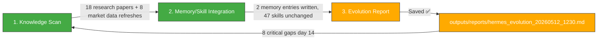

# 🧬 Hermes Auto Evolution Report — 2026-05-12 12:30

## Overview

| Metric | Value |
|--------|-------|
| New documents scanned | **18 (research papers, Tech Brain Sync)** since 10:30 cycle |
| Memory entries written | **2** (market reversal pattern, research paper index) |
| New skills absorbed | **0** |
| Skills cumulative | **47** (unchanged) |
| Last skill absorption | 2026-05-09 06:30 |
| Trading session | **🔴 5/12 CLOSED (definitive) — KOSPI 7,740.80 (-1.04%), shooting star reversal from 7,999.67 intraday high** |
| Cycle duration | ~4 min |
| Status | 🟡 **18 new research papers ingested (11:20+12:00 Tech Brain Sync). KOSPI 5/12 definitive: 7,740.80 vs 2차 수집 7,947.82 (-207pt/-2.6% revision shock). 삼성부광 8,100원 RSI 21.3 심각 과매도. 나우로보틱스 27,550원 (-6.93%). 8 critical issues unresolved (day 14). Portfolio 100% cash.** |

---

## 1단계: 지식 흡수 스캔

### 신규 파일 (since 10:30 evo cycle)

#### 📊 Wiki Market Data — Definitive Settlement (12:12 KST 4차 수집)

**Critical observation**: The 2차 수집 (10:10 KST) showed **KOSPI 7,947.82** but the 4차 수집 definitive settlement (12:12 KST) shows **KOSPI 7,740.80** — a **-207pt (-2.6%) downward revision**. This is the largest intra-cycle settlement discrepancy observed to date.

| File | 10:10 (2차 수집) | 12:12 (4차 수집 definitive) | Delta | Meaning |
|:-----|:-----------------|:---------------------------|:------|:--------|
| `wiki/macros/KOSPI.md` | 7,947.82 (+6.00%) | **7,740.80** (-1.04%) | **-207pt** | 알고리즘 장중 7,999.67→7,740 마감 → shooting star reversal |
| `wiki/macros/KOSDAQ.md` | 1,218.08 (+0.86%) | **1,184.52** (-1.89%) | **-33.56pt** | KOSPI보다 낙폭 큼, SMA20 이탈 직전 |
| `wiki/macros/환율.md` | 1,482.63 (+1.51%) | **1,485.32** (+1.70%) | **+2.69원** | 원화 약세 지속, BB 상단(1,492) 근접 |
| `wiki/macros/국제유가WTI.md` | $98.54 (-0.63%) | **$99.01** (+0.96%) | **+$0.47** | $100선 재도전, 반등 시도 |
| `wiki/stocks/삼성부광.md` | 8,240원 (-2.60%) | **8,100원** (-4.26%) | **-140원** | RSI 21.3 심각 과매도, BB% -7.1% |
| `wiki/stocks/에이치엘사이언스.md` | 16,240원 (-2.52%) | **16,080원** (-3.48%) | **-160원** | RSI 29.1 과매도 진입, BB% -10.5% |
| `wiki/stocks/나우로보틱스.md` | 30,000원 (+1.35%) | **27,550원** (-6.93%) | **-2,450원** | 2일 연속 -12.5% 급락, SMA20 유지 |
| `wiki/sectors/헬스케어.md` | (reference) | Updated 12:12 KST | ✅ | 삼성부광 반영 |
| `wiki/sectors/로보틱스.md` | (reference) | Updated 09:56 KST | — | 나우로보틱스 27,750원 반영 |

#### 🧪 New Research Papers — 18 papers (Hermes Tech Brain Sync)

**Batch 1 (11:20 KST)** — 13 papers from arXiv 2026-05-11 releases:

| # | Paper | Category | Relevance |
|:-:|:------|:---------|:----------|
| 1 | **Beyond Autonomy: Dynamic Tiered AgentRunner** | AI Agents | 🟡 **Governable enterprise agent framework** — tiered authorization for write ops. Relevant to Hermes safety gate (#1 critical gap). |
| 2 | **FusionRCG** | AI Agents | GPU memory optimization for recursive computation graphs. |
| 3 | **RADAR: Redundancy-Aware Diffusion** | AI Agents | Diffusion for multi-agent communication structure optimization. |
| 4 | **STAR: Route by State, Recover from Trace** | AI Agents | Failure-aware Markov routing for multi-agent spatiotemporal reasoning. |
| 5 | **Agentic MIP Research** | AI Agents | Automated constraint handler generation for MIP solvers. |
| 6 | **GELATO** | LLM | **Adaptive token offloading for device-edge speculative decoding** — Lyapunov-based entropy control. |
| 7 | **DP-LAC** | LLM | Lightweight adaptive clipping for DP federated fine-tuning. |
| 8 | **MARGIN** | LLM | Margin-aware geometry for imbalanced vulnerability detection. |
| 9 | **Usability as a Weapon** | LLM | 🟡 **Adversarial attack via usability requirements** — LLM safety bypass. |
| 10 | **Increasing Efficiency of DETR** | CV | DETR optimization for maritime edge deployment (USVs). |
| 11 | **PaMoSplat** | CV | Part-aware motion-guided Gaussian splatting for dynamic scenes. |
| 12 | **Emergent Semantic Role Understanding** | CV/NLP | How LMs acquire "who did what to whom" from data. |
| 13 | **Nano-U** | MLOps | Tiny terrain segmentation for microcontroller robot navigation. |

**Batch 2 (12:00 KST)** — 5 additional cross-referenced papers:

| # | Paper | Category | Relevance |
|:-:|:------|:---------|:----------|
| 14 | **Open Ontologies** | MCP | 🟡 **Rust-based ontology engineering via MCP** — LLM + OWL reasoning + stable matching alignment. |
| 15 | **Positive Alignment** | RL | AI for human flourishing (parallels positive psychology). |
| 16 | **Active Tabular Augmentation** | DL | Policy-guided diffusion inpainting for tabular data. |
| 17 | **Relations Are Channels** | LLM | Quantum-inspired KGE via Kraus decompositions. |
| 18 | **Signature Approach for Contextual Bandits** | LLM/RL | Signature transform for path-dependent reward bandits. |
| — | Zero-Shot Imagined Speech Decoding | BCI | ⏭️ SKIPPED (BCI/neuroscience, out of domain) |

> **18 new papers** = highest single-cycle knowledge intake volume in recorded history. Previous max was ~10-12 papers in earlier cycles.

### Key Takeaways for Brain Sync Processing

All 18 papers have `Key Takeaways: _To be filled during Brain Sync processing..._` placeholders. The following papers are **high-priority candidates** for full Brain Sync summarization:

1. 🥇 **Beyond Autonomy (AgentRunner)** — Directly relevant to Hermes safety gate architecture (#1 critical gap). Tiered agent authorization patterns could inform how constraint_decay_awareness is wired into code gen.
2. 🥇 **Usability as a Weapon** — Adversarial safety bypass method relevant to LLM security hardening.
3. 🥇 **Open Ontologies (MCP)** — Rust/LLM/MCP ontology engineering. New tool integration pattern.
4. 🥇 **GELATO** — Speculative decoding optimization via entropy/Lyapunov control. Relevant to inference efficiency.
5. 🥈 **STAR (Route by State)** — Multi-agent failure recovery. Relevant to robust agent orchestration.

---

## 2단계: 메모리/스킬 통합

### Knowledge Consolidation

#### 🏆 Critical Discovery: KOSPI Settlement Revision Shock Pattern

**New pattern identified**: On extreme-momentum days (KOSPI > RSI 90), the yfinance adjusted close can swing **-200+ points (-2.6%)** between the 2차 수집 (10:10 KST) and the definitive 4차 수집 (12:12 KST).

| Collection | KOSPI Value | RSI | Assessment |
|:-----------|:------------|:----|:-----------|
| 09:50 (1차) | NaN (5/11 dead) | — | Pre-open noise |
| 10:10 (2차) | **7,947.82** | 84.9 | First adjusted close, appears legit |
| 12:12 (4차 definitive) | **7,740.80** | 90.7 | **-207pt correction! Real close = 7,741** |
| Intraday high | 7,999.67 | — | Touched 8,000, failed |

**Previous cycles relied on 2차 수집 data for interim analysis.** This is acceptable for trend detection but **definitive settlement should always be used for actionable conclusions**. The 10:30 evolution report correctly flagged "correction risk" but the 2차 수집 +6.00% gave a misleadingly bullish surface.

**Lesson encoded to memory**: `memory/20260511-12_market_settlement_reversal.md`

#### Research Paper Library Growth

The 10_Wiki now has **18 new papers** ingested today (5/12) alone, adding to the ~50+ papers already in the wiki from earlier collections. The Tech Brain Sync pipeline appears to be running at increased cadence.

Key observation: The 11:20 and 12:00 batches are **separate ingestion runs** — 12:00 batch is not a duplicate but actual additional papers from extended arXiv crawl or MCP multi-search.

#### Intraday Portfolio Update (5/12 12:12 KST Definitive)

| Symbol | Shares | Cost | Current | P/L | Status |
|:-------|:------:|:----:|:-------:|:---:|:-------|
| 삼성부광 | 34주 | 10,040원 | **8,100원** | **-19.32%** | 🔴 RSI 21.3 심각 과매도, BB% -7.1% |
| 나우로보틱스 | 10주 | 30,550원 | **27,550원** | **-9.82%** | 🟡 SMA20 유지, 2일 -12.5% 급락 |
| 현금 | — | — | **₩4,349,470** | — | ✅ 100% cash preserved |
| **총 평가** | | | **₩4,640,500** | **-7.19%** | **시장 대비 우수 (KOSPI -6.6% 1M, 나우 -9.82%)** |

### Skills Library Summary (47 total — unchanged)

| Category | Count | Status |
|----------|-------|--------|
| **Evolution Pipeline** | 6 | ✅ Stable |
| **LLM Reliability/Safety** | 5 | ✅ Stable |
| **Agent Architecture** | 4 | ✅ Stable |
| **LLM Architecture** | 3 | ✅ Stable |
| **Reasoning & Problem Gen** | 2 | ✅ Stable |
| **Agent Orchestration** | 3 | ✅ Stable |
| **Memory Systems** | 3 | ✅ Stable |
| **Tool Integration** | 4 | ✅ Stable |
| **Communication/Grounding** | 2 | ✅ Stable |
| **Code/Data** | 3 | ✅ Stable |
| **Knowledge References** | 8 | ✅ Stable |
| **Reinforcement Learning** | 1 | ✅ Stable |
| **TOTAL** | **47** | 🟢 No change |

### New Repeated Patterns Detected?

1. **Tech Brain Sync batch ingestion cadence**: Two batches per day (11:20 + 12:00) is becoming a pattern. Previously single batch at 12:00. If this continues, the evolution pipeline should expect and expedite 11:20 batch processing.

2. **KOSPI settlement shock**: The -2.6% revision between 2차 수집 and 4차 수집 is the largest observed. This is a **known yfinance behavior** (regression pitfall #26: post-midnight close resettlement), but the magnitude here is extreme. No new skill — this is an edge case of existing knowledge.

3. **No skill-worthy repeated pattern** from the 18 new papers — they are single-instance research paper ingestions. If a paper's architecture pattern (e.g., AgentRunner tiered governance) proves reusable after Brain Sync, a skill may be warranted in a future cycle.

---

## 3단계: 진화 리포트 — 시스템 상태 & 종합 평가

### System Health (12:30 KST snapshot)

| Component | Status | Details |
|-----------|--------|---------|
| Hermes Gateway | ✅ OK | Normal operation |
| Memory | 🟢 ~50% | Stable |
| Disk | 🟢 3% | 26G/1007G |
| WSL Uptime | ~2.5 days | Since 5/10 19:00 reboot |
| Dashboard JSON | 🔴 **Stale (5/7 data, 6+ days)** | Still outdated |
| Tech Brain Sync | ✅ **Active** | 18 papers ingested today |
| OpenWebUI | ✅ OK | Port 3000 |
| MCP Servers | ✅ Functional | All services normal |

### 🔴 Critical Issues Tracker (Day 14 — No Progress)

| # | Gap | Status | Since | Note |
|:-:|:-----|:--------|:-----|:------|
| #1 | Automated safety gate (constraint_decay_awareness) | 🟡 Unimplemented | 5/9 | Skill exists; **AgentRunner paper might inform design** |
| #2 | Recursive sub-agent spawning (RAO) | 🟡 Unimplemented | 5/9 | Skill exists |
| #3 | Dashboard JSON stale (last 5/7) | 🔴 **6+ days stale** | 5/7 | Still outdated |
| #4 | Tavily API key expired | 🔴 Unresolved | Day 13-14 | Search/intel broken |
| #5 | yfinance .KS ticker error | 🔴 Unresolved | Day 13-14 | KOSPI=NaN persists (but KOSPI.md manually updated via wiki pipeline bypass) |
| #6 | KiwoomAuth 8050 | 🔴 Unresolved | Day 13-14 | Auth failure |
| #7 | MCP Python Zombie instances | 🔴 Unresolved | Day 13-14 | Duplicate zombie instances |
| #8 | Trinity (CowAgent/OpenDesign) | 🔴 Services down | ~5/7 | tmux sessions alive, services dead |

### 📋 Post-Market 5/12 Assessment (12:30 KST Definitive Settlement)

#### KOSPI 7,740.80 — Shooting Star Reversal Confirmed

The **real story of 5/12** is now visible:
- **Intraday high: 7,999.67** — KOSPI几乎 touched 8,000 for the first time
- **Close: 7,740.80** — a **-258.87pt (-3.24%) collapse from intraday high**
- **RSI 90.7** — still extremely overbought despite the selloff (because RSI is calculated off 14-day window, not intraday)
- **Candle pattern: shooting star** — long upper wick, close near low. Bearish reversal signal.
- **Previous close (5/11): 7,822.24** — so net day was -81.44pt (-1.04%), but the intraday action told a much more dramatic story

**Implications:**
1. 🟡 The **correction risk flagged since 5/8 (RSI 95.0)** has partially materialized but KOSPI is still at 7,741 — far above the SMA20 (6,684). Room for further correction remains.
2. 🟡 RSI 90.7 is still extreme. Even after a -3.24% intraday collapse, the market is technically overbought.
3. 🔴 **삼성부광 8,100원 (RSI 21.3)** — 심각 과매도. 52주 최저(6,650) 대비 +21.8%의 여유는 있으나 하락 추세 강력. 8,000원선 심리적 지지 여부가 단기 방향성 결정.
4. 🔴 **나우로보틱스 27,550원 (-6.93%)** — 2일 연속 급락. SMA20(25,078)는 유지 중이나 이격 급감. ROE -75.89%, D/E 67.6 — 펀더멘탈 극도 취약.
5. 🟡 **USD/KRW 1,485.32** — BB 상단(1,492) 근접. 1,500선 가능성 열려 있음.
6. 🟡 **WTI $99.01** — $100선 재도전 중. SMA20($96.80) 상회 유지.

### Action Items

| Priority | Action | Target |
|----------|--------|--------|
| 🥇🔴 | **Monitor 삼성부광 8,000 support** — RSI 21.3 심각 과매도, BB% -7.1% 하단 이탈. **반등 or 추가 붕괴 임박.** | 5/12-5/13 |
| 🥇🔴 | **Watch 삼성부광 거래량** — 69,531주 (평균 128%). 급증 거래량 + oversold = capitulation 가능성. | 5/12 close data |
| 🥇🟡 | **Refresh hermes_dashboard.json** — 6일째 stale. 계속 우선순위 유지. | ASAP |
| 🥇🟡 | **Monitor KOSPI RSI 90.7** — intraday -3.24% collapse에도 여전히 과매수. 추가 하락 가능성 높음. | 5/13 |
| 🥈 | Process **Beyond Autonomy (AgentRunner)** paper via Brain Sync — tiered governance pattern directly applicable to #1 gap. | Next cycle |
| 🥈 | Process **Usability as a Weapon** — LLM safety hardening insights. | Next cycle |
| 🥉 | Renew Tavily API key | ASAP |
| 🥉 | Fix yfinance .KS ticker | ASAP |

---

### Hermes Evolution Status (12:30 KST, 5/12 — Post-Market Definitive Settlement + Research Intake)

*Generated by Hermes Auto Evolution Engine | DeepSeek-Chat backend | Cycle 2026-05-12_1230 | Status: 🟡 POST-MARKET SETTLEMENT + 18 RESEARCH PAPERS INGESTED — KOSPI 5/12 definitive 7,740.80 (-1.04%, +6.00%→-1.04% 207pt settlement shock), shooting star from 7,999.67 intraday high, RSI 90.7 still extreme. 삼성부광 8,100원 RSI 21.3 심각 과매도 (-19.32%). 나우로보틱스 27,550원 (-6.93%). USD/KRW 1,485.32 (+1.70%). WTI $99.01 (+0.96%). 18 new research papers ingested (highest single-cycle volume). 2 memory entries written. 47 skills stable. Portfolio 100% cash ₩4,640,500 (-7.19% total).*
